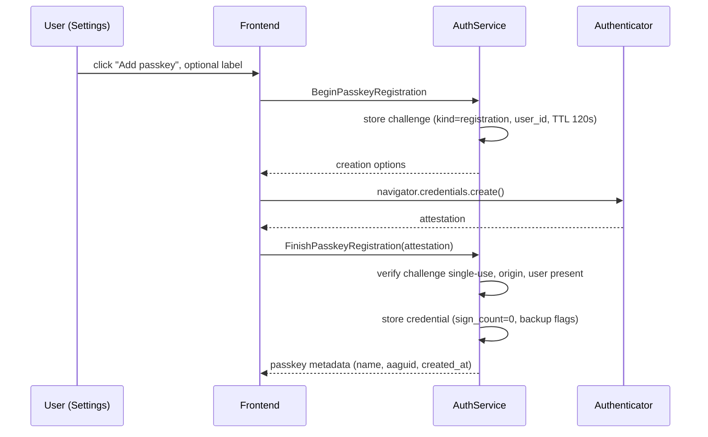
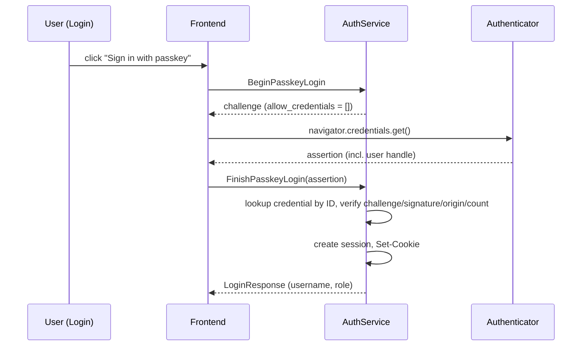

# Authentication & Session Management Design Document

This document specifies the evolution of the authentication subsystem: passkey (WebAuthn) support, session lifetime redesign, role-based access control enforcement, and associated hardening work. It supersedes the session and RBAC guidance in `docs/security.md` (§2, §3) where the two conflict; `docs/security.md` should be updated as each phase lands.

---

## 1. Goals & Non-Goals

### 1.1. Goals

1. **Passkey authentication** — users can register WebAuthn credentials from the settings page and sign in with a passkey alone. Username/password login remains fully supported.
2. **Sensible session lifetimes** — replace the single 24-hour expiry with an idle (sliding) timeout plus an absolute cap, with an optional "remember me" tier.
3. **Enforced RBAC** — the `admin` / `viewer` roles documented in `docs/security.md` are actually checked by the backend.
4. **Login hardening** — rate limiting and timing side-channel mitigation on credential verification.
5. **Account visibility** — an audit trail of auth events and a session management UI (list / revoke active sessions).
6. **Transport hardening** — `Secure` cookie flag driven by configuration.

### 1.2. Non-Goals

* **TOTP / authenticator-app 2FA** — passkeys supersede it; supporting both doubles the ceremony surface for little benefit.
* **JWT / refresh tokens** — sessions are server-side rows in SQLite, which is the correct model for a single-binary application. Stateless tokens would remove revocability without adding anything.
* **Multi-tenant user management** — the product remains single-admin-oriented; user creation stays limited to first-run setup. User management RPCs can be a follow-up.
* **OAuth / OIDC identity providers** — may be revisited later; out of scope here.

---

## 2. Current State (Baseline)

| Area | Current behavior | Location |
| :--- | :--- | :--- |
| Password hashing | bcrypt `DefaultCost` (10) | `internal/auth/service.go:63` |
| Session token | 32 random bytes, hex-encoded, stored in `sessions` | `internal/auth/service.go` |
| Session expiry | Fixed 24 hours, checked on each request | `interceptor.go` |
| Cookie | `session_id=...; Path=/; HttpOnly; SameSite=Lax` (no `Secure`) | `service.go:125` |
| Auth enforcement | Connect interceptor; allowlist of unauthenticated procedures | `internal/auth/interceptor.go` |
| RBAC | Role stored and returned, **never enforced** | — |
| Rate limiting | None on `Login` | — |
| Expired session purge | `PurgeExpiredSessions` query exists but is never called | `internal/db/sessions.sql.go` |
| SyncLogs | Unauthenticated (browser-side log shipping) | `interceptor.go` allowlist |
| bcrypt cost drift | `docs/security.md` mandates cost ≥ 12; code uses 10 | — |

Known gaps addressed by this document: no passkeys, sessions too short with no renewal, RBAC unenforced, no brute-force protection, no auth audit trail, no session visibility.

---

## 3. Session Lifetime Redesign

### 3.1. Two-Clock Model (Idle + Absolute)

The industry-standard pattern (OWASP Session Management Cheat Sheet) is a pair of timeouts rather than one fixed expiry:

| Clock | Default | "Remember me" | Purpose |
| :--- | :--- | :--- | :--- |
| Idle timeout (sliding) | 7 days | 30 days | Kills abandoned sessions; refreshed by activity |
| Absolute cap | 30 days | 90 days | Forces periodic re-authentication; bounds stolen-cookie lifetime |

For a self-hosted infrastructure dashboard, 7d/30d is a deliberate trade-off: sessions outlive a work week without becoming permanent. All values are configurable (§3.5).

### 3.2. Schema Changes

Migration `000XX_session_clocks.sql` adds two columns to `sessions`:

```sql
-- +goose Up
ALTER TABLE sessions ADD COLUMN last_seen_at DATETIME NOT NULL DEFAULT CURRENT_TIMESTAMP;
ALTER TABLE sessions ADD COLUMN absolute_expires_at DATETIME NOT NULL;
-- Backfill: existing rows get absolute = expires_at (24h), forcing one re-login on upgrade.
UPDATE sessions SET absolute_expires_at = expires_at;

CREATE INDEX idx_sessions_last_seen_at ON sessions(last_seen_at);

-- +goose Down
DROP INDEX IF EXISTS idx_sessions_last_seen_at;
ALTER TABLE sessions DROP COLUMN absolute_expires_at;
ALTER TABLE sessions DROP COLUMN last_seen_at;
```

`expires_at` is reinterpreted as the **idle deadline** (`last_seen_at + idle_timeout`). `absolute_expires_at` is fixed at creation (`now + absolute_cap`) and never extended.

### 3.3. Sliding Renewal Logic

In `Interceptor.authenticate`, after loading a valid session:

```go
now := time.Now()
if now.After(session.AbsoluteExpiresAt) {
    _ = i.queries.DeleteSession(ctx, session.SessionID)
    return ctx, connect.NewError(connect.CodeUnauthenticated, errors.New("session expired"))
}
if now.After(session.ExpiresAt) {
    _ = i.queries.DeleteSession(ctx, session.SessionID)
    return ctx, connect.NewError(connect.CodeUnauthenticated, errors.New("session expired"))
}
// Slide only if we've burned through half the idle window; avoids a write on every request.
if now.After(session.ExpiresAt.Add(-s.idleTimeout/2)) {
    newIdle := now.Add(s.idleTimeout)
    if newIdle.After(session.AbsoluteExpiresAt) {
        newIdle = session.AbsoluteExpiresAt
    }
    _ = i.queries.TouchSession(ctx, db.TouchSessionParams{
        SessionID: session.SessionID,
        ExpiresAt: newIdle,
        LastSeenAt: now,
    })
}
```

New queries:

```sql
-- name: TouchSession :exec
UPDATE sessions SET expires_at = ?, last_seen_at = ? WHERE session_id = ?;

-- name: ListSessionsByUser :many
SELECT s.*, u.username FROM sessions s JOIN users u ON u.id = s.user_id
WHERE s.user_id = ? ORDER BY s.last_seen_at DESC;

-- name: DeleteSessionsByUser :execrows
DELETE FROM sessions WHERE user_id = ? AND session_id != ?;
```

`CreateSession` gains `absolute_expires_at` and `last_seen_at` parameters; the `remember_me` flag from the login request selects the idle/absolute pair.

### 3.4. Expiry Purge Job

`PurgeExpiredSessions` already exists but is dead code. Wire it into the existing scheduler (or a simple `time.Ticker` goroutine started in `cmd/serve.go`) on a 1-hour interval:

```go
go func() {
    ticker := time.NewTicker(time.Hour)
    defer ticker.Stop()
    for range ticker.C {
        if err := queries.PurgeExpiredSessions(ctx, time.Now()); err != nil {
            logger.Warn("session purge failed", "error", err)
        }
    }
}()
```

Purge condition: `expires_at < now OR absolute_expires_at < now` (the query must compare both clocks).

### 3.5. Configuration

New `auth` section in the koanf `Config` struct:

```yaml
auth:
  session_idle_timeout: 168h      # 7 days; DMANAGER_AUTH_SESSION_IDLE_TIMEOUT
  session_absolute_timeout: 720h  # 30 days; DMANAGER_AUTH_SESSION_ABSOLUTE_TIMEOUT
  remember_me_idle_timeout: 720h
  remember_me_absolute_timeout: 2160h
  secure_cookies: auto            # auto | always | never
  bcrypt_cost: 12
webauthn:
  rp_id: ""                       # defaults to request Host without port
  origins: []                     # e.g. ["https://dmanager.example.com"]
  require_user_verification: preferred
```

* `secure_cookies: auto` sets the `Secure` attribute only when the request arrived over HTTPS. Since `dmanager` itself serves plain HTTP (`ListenAndServe`, TLS terminated by the reverse proxy per `docs/deployment.md`), detection is the `X-Forwarded-Proto: https` header. `always` is for proxies that don't set the header; `never` for plain-HTTP LAN use.
* `bcrypt_cost` closes the drift between `docs/security.md` (min 12) and the code (10). Existing hashes are not re-hashed; the cost applies at next password set. `Login` compares against whatever cost the stored hash carries.
* Timeouts accept Go duration strings (`168h`), matching koanf conventions.

### 3.6. Cookie Shape

```go
fmt.Sprintf("session_id=%s; Path=/; HttpOnly; SameSite=Lax; Max-Age=%d%s",
    sessionID, maxAge, secureSuffix)
```

* `Max-Age` set to the idle deadline so browser-side expiry matches server-side (a missing `Max-Age` makes the cookie session-scoped, which desyncs from the DB row).
* `Secure` per config above.
* Keep `SameSite=Lax` — Connect RPC is POST-based, so `Lax` already blocks cross-site POSTs; this is the CSRF defense and stays.
* Do **not** adopt the `__Host-` prefix yet: it requires `Secure` on every deployment, including plain-HTTP LAN installs, which is a supported configuration.

---

## 4. Passkey Authentication (WebAuthn)

### 4.1. Libraries

| Side | Library | Notes |
| :--- | :--- | :--- |
| Go | `github.com/go-webauthn/webauthn` | De-facto standard; protocol/typed API |
| TS | `@github/webauthn-json` | Base64url ↔ `ArrayBuffer` marshaling for the Connect/protobuf boundary |

Protobuf `bytes` fields round-trip binary credential/challenge data; `@github/webauthn-json`'s `navigator.credentials.get()/create()` wrappers produce JSON-safe strings that map directly onto the proto fields.

### 4.2. Relying Party Configuration

WebAuthn binds credentials to an **RP ID** (a registrable domain) and a set of **allowed origins**. This must be pinned in config, not derived per-request (deriving from the `Origin` header lets an attacker with DNS control register credentials for their own origin):

* `webauthn.rp_id`: defaults to the request `Host` minus port when unset — acceptable for a single-domain deployment; must be set explicitly when the dashboard is reachable on multiple domains.
* `webauthn.origins`: must list every origin users reach the UI through (scheme + host + port), including `https://localhost:PORT` variants for local access.
* Mismatched RP ID/origin is the single most common passkey integration failure; the settings page surfaces the effective values for debugging.

### 4.3. Schema

Migration `000XX_webauthn.sql`:

```sql
-- +goose Up
CREATE TABLE webauthn_credentials (
    credential_id BLOB PRIMARY KEY,       -- raw ID from the authenticator
    user_id INTEGER NOT NULL,
    public_key BLOB NOT NULL,             -- COSE key
    attestation_type TEXT NOT NULL,
    transport TEXT NOT NULL DEFAULT '',   -- comma-separated: internal,hybrid,usb,nfc,ble
    aaguid BLOB NOT NULL,                 -- authenticator model for friendly naming
    sign_count INTEGER NOT NULL DEFAULT 0,-- clone detection
    clone_warning INTEGER NOT NULL DEFAULT 0,
    backup_eligible INTEGER NOT NULL DEFAULT 0,  --CredentialFlags
    backup_state INTEGER NOT NULL DEFAULT 0,
    name TEXT NOT NULL DEFAULT '',        -- user-assigned label ("YubiKey 5C")
    created_at DATETIME NOT NULL DEFAULT CURRENT_TIMESTAMP,
    last_used_at DATETIME,
    FOREIGN KEY (user_id) REFERENCES users(id) ON DELETE CASCADE
);
CREATE INDEX idx_webauthn_credentials_user_id ON webauthn_credentials(user_id);

CREATE TABLE webauthn_challenges (
    id INTEGER PRIMARY KEY AUTOINCREMENT,
    challenge BLOB NOT NULL,
    kind TEXT NOT NULL,                   -- 'registration' | 'login'
    user_id INTEGER,                      -- NULL for usernameless login
    expires_at DATETIME NOT NULL,
    consumed INTEGER NOT NULL DEFAULT 0
);
CREATE INDEX idx_webauthn_challenges_expires_at ON webauthn_challenges(expires_at);

-- +goose Down
DROP TABLE IF EXISTS webauthn_challenges;
DROP TABLE IF EXISTS webauthn_credentials;
```

**Challenge lifecycle:** generated at `Begin*`, single-use (marked `consumed = 1` at `Finish*`), TTL 120 seconds, deleted by the same purge job as sessions. Storing challenges in SQLite (rather than a cookie) keeps the ceremony state server-authoritative and works across the multiple tabs the dashboard supports.

### 4.4. Protocol Additions (`auth.proto`)

```protobuf
service AuthService {
  // ... existing RPCs ...

  // --- Passkey registration (Authenticated) ---
  rpc BeginPasskeyRegistration(BeginPasskeyRegistrationRequest)
      returns (BeginPasskeyRegistrationResponse);
  rpc FinishPasskeyRegistration(FinishPasskeyRegistrationRequest)
      returns (FinishPasskeyRegistrationResponse);

  // --- Passkey login (Unauthenticated) ---
  rpc BeginPasskeyLogin(BeginPasskeyLoginRequest) returns (BeginPasskeyLoginResponse);
  rpc FinishPasskeyLogin(FinishPasskeyLoginRequest) returns (FinishPasskeyLoginResponse);

  // --- Credential management (Authenticated) ---
  rpc ListPasskeys(ListPasskeysRequest) returns (ListPasskeysResponse);
  rpc RenamePasskey(RenamePasskeyRequest) returns (RenamePasskeyResponse);
  rpc DeletePasskey(DeletePasskeyRequest) returns (DeletePasskeyResponse);

  // --- Session management (Authenticated) ---
  rpc ListSessions(ListSessionsRequest) returns (ListSessionsResponse);
  rpc RevokeSession(RevokeSessionRequest) returns (RevokeSessionResponse);
  rpc RevokeAllOtherSessions(RevokeAllOtherSessionsRequest)
      returns (RevokeAllOtherSessionsResponse);

  // --- Audit (Authenticated; admin for full list) ---
  rpc ListAuthEvents(ListAuthEventsRequest) returns (ListAuthEventsResponse);
}
```

Message shapes follow the WebAuthn spec's JSON representation so the frontend can pass them through `@github/webauthn-json` with minimal transformation: `BeginPasskeyRegistrationResponse` carries `challenge` (bytes), `rp` (id, name), `user` (id, name, display_name), `pub_key_cred_params`, `authenticator_selection`, and `exclude_credentials`; `FinishPasskeyRegistrationRequest` carries `id`, `raw_id`, `type`, `response { client_data_json, attestation_object, transports }`, `client_extension_results`. Login mirrors this with `allow_credentials` and `assertion` payloads. (Full field definitions are mechanical and follow L3 of the WebAuthn spec; they are enumerated in the implementation story rather than duplicated here.)

### 4.5. Registration Flow (Settings Page)



Registration requirements:

* `authenticator_selection.resident_key = preferred`, `user_verification = preferred` — discoverable credentials enable the usernameless login flow below.
* `exclude_credentials` lists the user's existing credentials so the same authenticator doesn't double-register silently; the platform UI handles the "credential already exists" error gracefully.
* The `name` label can be set at creation or renamed later; friendly device naming derives from the AAGUID (small embedded AAGUID→name table, no network call).

### 4.6. Login Flow (Usernameless)

`BeginPasskeyLogin` sends an **empty** `allow_credentials` list, triggering client-side discoverable-credential selection: the browser/platform shows the picker with the resident credential, the response contains the `user_handle`, and the server resolves the user from the credential's `user_id`. The user never types a username.



Verification rules (enforced via `go-webauthn`, listed for reviewability):

1. Challenge matches an unconsumed, unexpired `login` row.
2. Origin ∈ `webauthn.origins`; RP ID hash matches.
3. Signature validates against the stored public key.
4. `sign_count`: if the new count ≤ stored count and both are nonzero, set `clone_warning = 1` and reject the login (possible cloned authenticator).
5. If `require_user_verification = required`, `user_verified` must be true.
6. On success: update `sign_count`, `last_used_at`, `backup_state`; issue the same session cookie as password login (shared code path — one `issueSession(ctx, userID, rememberMe)` helper).

Rate limiting (§6) applies to `BeginPasskeyLogin`/`FinishPasskeyLogin` per source IP: the challenge table doubles as a natural slowdown, but failed-finish attempts should count toward the same backoff counter as password failures.

### 4.7. Lockout Guardrails

* `DeletePasskey` and password changes refuse to leave a user with **zero** usable login methods (no passkey and no password). API: `FailedPrecondition` with an explanatory message.
* Since users are created via `SetupAdmin` with a password, the password always exists initially; a future "remove password" option must additionally require ≥ 1 `backup_eligible` (synced) passkey.
* `GetServerStatus` gains a `passkey_login_enabled` hint (derived from `webauthn.rp_id`/`origins` being usable) so the login page can hide the passkey button when unconfigured.

### 4.8. Frontend Changes

| File | Change |
| :--- | :--- |
| `components/Login.tsx` | Two modes: passkey button (default when enabled) + username/password form; "remember me" checkbox feeds `LoginRequest.remember_me` |
| `components/Settings.tsx` | New "Security" section: passkey list (name, created, last used, synced badge), add/rename/delete; active sessions list with revoke; recent auth events |
| `hooks/useAuth.tsx` | No material change — `LoginResponse` shape is shared between both flows |
| `services/syncer.ts` | Unchanged; piggybacks on the session cookie |

---

## 5. RBAC Enforcement

### 5.1. Procedure → Role Map

The interceptor grows a static authorization table, replacing the current binary "authenticated or allowlisted" check. Defaults follow the matrix already documented in `docs/security.md` §3.2:

```go
// viewer procedures: any authenticated user
// admin procedures: require User.Role == "admin" → connect.CodePermissionDenied

var adminProcedures = map[string]bool{
    "/dmanager.v1.ContainerService/StartContainer":            true,
    "/dmanager.v1.ContainerService/StopContainer":             true,
    "/dmanager.v1.ContainerService/UpgradeContainer":          true,
    "/dmanager.v1.ContainerService/SetContainerAutoUpdate":    true,
    "/dmanager.v1.ContainerService/CheckContainerUpdates":     true,
    "/dmanager.v1.SettingsService/UpdateSettings":             true,
    "/dmanager.v1.SettingsService/TestGotifyNotification":     true,
    // AuthService management stays viewer-accessible for self (sessions, own passkeys)
}
```

`GetMe`, `Logout`, passkey self-management, and `ListAuthEvents` (own events) require only `viewer`. The mapping is generated from a single source of truth — a Go table co-located with the interceptor — and unit tests assert that every generated procedure string is covered by exactly one bucket (allowlisted / viewer / admin), so new RPCs cannot ship unclassified.

### 5.2. Enforcement Point

Authorization runs in `Interceptor.WrapUnary` / `WrapStreamingHandler` immediately after `authenticate` succeeds, before the handler. Handlers never re-check roles (defense-in-depth exceptions are allowed but discouraged). Failure returns `PermissionDenied` with the username logged.

---

## 6. Login Hardening

### 6.1. Rate Limiting

In-memory limiter (no schema changes; single-process deployment makes this viable) keyed on both username and source IP:

* **Window:** sliding 15 minutes.
* **Threshold:** 5 failures → lockout, exponential: 1 min, 2, 4, … capped at 15 min. Successful login resets the counter.
* **Scope:** password `Login` failures, passkey `FinishPasskeyLogin` verification failures, and `BeginPasskeyLogin` flood (≥ 20 begins/min/IP) all feed the counter.
* **Response:** `ResourceExhausted` with `RetryInfo`-style metadata so the UI can show "try again in N minutes".
* **Reset on restart** is acceptable (documented limitation); failures are also written to the audit log (§7).

Extract the client IP from `X-Forwarded-For` (first entry, trusting only when a configured proxy is present) falling back to `RemoteAddr`.

### 6.2. Timing Side Channel

Today a nonexistent username returns before bcrypt runs, making valid usernames measurable. Fix: on `sql.ErrNoRows`, run `bcrypt.CompareHashAndPassword` against a fixed dummy hash (generated once at startup with the configured cost) before returning `Unauthenticated`. All failure paths take both the DB lookup and one bcrypt comparison.

### 6.3. Password Policy

Enforced in `SetupAdmin` (and any future password-set path):

* Minimum length 12 (frontend hints passphrases; no composition rules, per NIST SP 800-63B).
* Optional, off by default: HIBP k-anonymity range check (`https://api.pwnedpasswords.com/range/`, first 5 SHA-1 hex chars, no full hash ever transmitted; feature-flagged because it phones out).

---

## 7. Auth Audit Trail

New table + queries, surfaced in Settings → Security:

```sql
-- +goose Up
CREATE TABLE auth_events (
    id INTEGER PRIMARY KEY AUTOINCREMENT,
    user_id INTEGER,                      -- NULL for pre-auth failures
    username TEXT,                        -- as attempted, for failed logins
    event TEXT NOT NULL,                  -- login_success, login_failed, logout,
                                          -- passkey_added, passkey_removed, rate_limited,
                                          -- session_revoked, setup_admin, ...
    detail TEXT NOT NULL DEFAULT '',      -- e.g. "passkey", "invalid credentials", IP
    created_at DATETIME NOT NULL DEFAULT CURRENT_TIMESTAMP
);
CREATE INDEX idx_auth_events_created_at ON auth_events(created_at);
CREATE INDEX idx_auth_events_user_id ON auth_events(user_id);

-- +goose Down
DROP TABLE IF EXISTS auth_events;
```

* Written by `Service` methods and the interceptor (rate-limit rejections), never containing credentials or tokens — usernames and coarse reasons only.
* Retention: rows older than 90 days purged by the background job (§3.4).
* `ListAuthEvents`: viewers see their own events; admins see all. Paginated (limit/offset), newest first.

---

## 8. SyncLogs Authentication

`LogService/SyncLogs` is currently allowlisted because the frontend ships logs from the browser. Once session cookies exist, the browser syncer should simply require authentication: an expired session drops queued logs locally (already the behavior on any failure). Change:

1. Remove `/dmanager.v1.LogService/SyncLogs` from `isUnauthenticatedProcedure`.
2. Confirm the frontend syncer sends credentials (it uses the Connect client with browser cookies, so no change expected).
3. Unauthenticated sync attempts return `Unauthenticated` and are audit-logged.

If a future headless agent needs to ship logs, it gets a provisioned API key (separate design), not an allowlist entry.

---

## 9. Implementation Plan

Phases are independently shippable and ordered by value/effort. Each maps to stories in `docs/stories.md`.

### Phase 1 — Sessions & cookies (small, immediate UX win)
1. Migration: session clocks; `TouchSession`, `ListSessionsByUser`, `DeleteSessionsByUser` queries; `CreateSession` params.
2. Sliding renewal + absolute cap in interceptor; `Max-Age`/`Secure` cookie attributes; config plumbing (`auth.*` keys, `bcrypt_cost` on new hashes).
3. Purge job wiring (sessions, challenges, auth events).
4. `remember_me` on `LoginRequest`.

### Phase 2 — RBAC + login hardening (small, closes security gaps)
1. Procedure→role map, `PermissionDenied` enforcement, coverage test.
2. Rate limiter (password + passkey-finish paths), IP extraction helper.
3. Dummy-hash timing equalization; password policy on `SetupAdmin`.
4. Remove `SyncLogs` from the allowlist.

### Phase 3 — Audit trail & session UI (medium)
1. `auth_events` migration + writes at every auth decision point.
2. `ListAuthEvents`, `ListSessions`, `RevokeSession`, `RevokeAllOtherSessions` RPCs.
3. Settings → Security tab: events feed, session list with revoke.

### Phase 4 — Passkeys (largest)
1. `go-webauthn` + `@github/webauthn-json` dependencies; `webauthn.*` config.
2. Migrations: credentials + challenges tables.
3. Registration RPCs + settings UI section.
4. Login RPCs + usernameless login UI; lockout guardrails on deletion.
5. Coverage: unit tests for ceremony verification edge cases (consumed challenge, expired challenge, wrong origin, sign-count regression, backup flags).

### 4→1 upgrade note
Phase 1's backfill forces exactly one re-login for sessions created before the upgrade (existing rows get `absolute_expires_at = expires_at`). Acceptable and called out in release notes.

---

## 10. Testing Strategy

Extends `docs/testing.md`:

* **Unit (Go):** sliding-renewal boundary math (idle/2 threshold, absolute clamp); rate-limit counter transitions; dummy-hash path equalizes miss/hit; RBAC map coverage over all generated procedures; challenge single-use enforcement.
* **Integration:** full password login → slide → revoke flow against a temp SQLite DB; passkey ceremony using `go-webauthn/webauthn/test` mocks (the library ships test authenticator helpers).
* **Frontend (vitest/msw):** login form passkey/password modes; settings security tab states (no passkeys, one passkey, delete-last blocked); session revocation optimistic UI.
* **Security checklist additions** (merge into `docs/security.md` §5): passkey challenges single-use and TTL-bound; no credential secrets logged; RBAC map has no unclassified procedures.

---

## 11. Open Questions

1. **Admin-procedure list**: the map in §5.1 was verified against the current protos, but it is manually maintained — the coverage test (§5.1) must fail whenever a new RPC ships unclassified, and `docs/security.md` §3.2 should be regenerated from the same table.
2. **Reverse-proxy trust**: is `X-Forwarded-For` guaranteed by the documented deployment? If not, rate limiting by IP degrades to per-instance `RemoteAddr` (still fine for single-binary installs) — decide whether a `server.trusted_proxy` config knob is warranted.
3. **Remember-me default**: checkbox opt-in (proposed) vs. always-on long sessions. Opt-in is the conservative default; revisit after feedback.
4. **Multiple users**: user management (create viewer, change roles) is deferred — the schema supports it, but no RPCs are specified here. Needed before any multi-user rollout.
