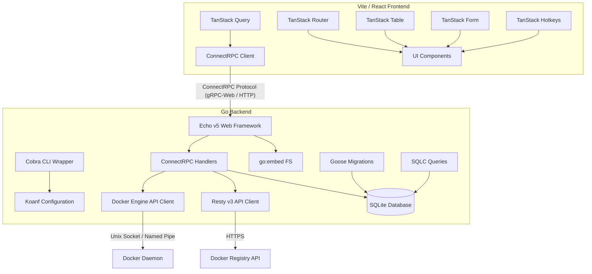

# System Architecture & Technical Design Document

This document outlines the technical design and system architecture for the Docker Container Manager web application.

---

## 1. System Architecture Overview

The system follows a classic client-server model, optimized for low footprint and zero-dependency deployment. 



---

## 2. Backend Design

The backend is built in Go, prioritizing performance, strict type-safety, and minimal resource usage.

### 2.1. Command Line Interface (Cobra)
* **Cobra CLI Wrapper:** The application binary exposes commands via `spf13/cobra`.
* **Commands:**
  * `serve`: Launches the Echo web server and starts the daemon loops.
  * `migrate`: Explicitly runs or reverts database migrations.
  * `version`: Prints build details.

### 2.2. Configuration Management (Koanf)
* **Koanf Config Manager:** Application config is managed using `koanf`.
* **Sources & Precedence:** Configuration values are merged in order of increasing priority (later overrides earlier):
  1. Defaults (hardcoded)
  2. TOML Configuration File (e.g., `config.toml`)
  3. Environment variables (prefixed with `DMAN_`)
  4. Command-line flags (parsed via Cobra/pflag)
* **Structure:** Configures system parameters (host, port, SQLite path, global schedule intervals).
* **Registry Credentials Block:** The configuration structure includes a `registries` list, allowing operators to define server locations and credentials (host URL, username, password/token) for private registries (such as `ghcr.io` or private Docker Hub spaces) to perform authenticated pulls and check tag digests.

### 2.3. Web Framework (Echo v5), ConnectRPC & Protobuf Layout
* **Echo v5 Framework:** Used as the base HTTP router.
* **ConnectRPC Integration:** 
  * Services are defined using standard Protocol Buffers (`.proto`).
  * ConnectRPC generates standard Go HTTP handlers.
  * These handlers are mounted cleanly as sub-routes on Echo's routing engine using standard Go `http.Handler` routing compatibility.
  * JSON and traditional REST endpoints are not exposed; all interactions occur over the Connect protocol (using binary Protobuf payload formats for efficiency and type safety).
* **Protobuf Directory & Generation Schema (Buf):**
  * Protocol Buffer definitions reside under `proto/dmanager/v1/`.
  * The project utilizes **`buf`** (instead of raw `protoc`) to manage dependencies, lint proto files, and generate code.
  * Generated Go artifacts are output to `internal/gen/dmanager/v1/`.
  * Generated TypeScript/React clients are output to `frontend/src/gen/dmanager/v1/`.

### 2.4. Data Storage & Migrations (SQLite, SQLC, Goose)
* **Database & Driver (CGO-free):** To ensure a single, statically compiled binary that is easy to cross-compile for multiple architectures, **CGO is fully disabled (`CGO_ENABLED=0`)**.
  * The database engine selected is SQLite.
  * The driver utilized is **`ncruces/go-sqlite3`**, a modern, high-performance pure Go SQLite driver. It compiles the official SQLite library into WASM and executes it via `wasm2go`, offering superior performance and compatibility over other transpilation-based alternatives (like `modernc.org/sqlite`) while maintaining 100% compliance with Go's `database/sql` interface.
  * The database runs in WAL (Write-Ahead Logging) mode to maximize write concurrency and read performance.
* **Concurrency & Lock Mitigation:**
  * To prevent transient SQLite `database is locked` errors during concurrent operations (e.g., background schedulers updating container statuses while users access auth/logs):
    * The write connection pool size is capped at `MaxOpenConns = 1`.
    * A default connection initialization queries `PRAGMA busy_timeout = 5000;` on startup to instruct SQLite to wait up to 5 seconds for locked operations before failing.
* **Migrations (Goose):** Database schema changes are version-controlled with `.sql` files and managed using `pressly/goose`. Migrations are embedded using `go:embed` and executed automatically at application startup.
* **SQLC for Queries:** Type-safe database queries are generated at compile-time using SQLC. SQLC reads the migration schemas and user-defined SQL queries, generating high-performance Go structures and execution methods without ORM overhead.

### 2.5. 3rd-Party Communications (Resty v3)
* **Resty v3 HTTP Client:** Used for external registry queries (such as querying registry APIs to fetch image manifests and tags).
* **Registry Interactions:** Fetches image metadata from registries (e.g., Docker Hub, GHCR) to determine if a newer version of a container image exists.

### 2.6. Embedded Production Build (`go:embed`)
* **Single Binary Output:** In production, Vite's build artifacts (`dist/` containing HTML, JS, CSS, assets) are compiled into the Go binary using `go:embed`.
* **Routing Fallback:** Echo serves these static assets directly from memory, mapping unknown client-side routes back to `index.html` to allow TanStack Router to handle SPA routing.

### 2.7. Code Quality & Standards (golangci-lint)
* **Linting & Quality Control:** Go backend code standards are enforced via `golangci-lint`.
* **Version Pinning & Reproducibility:** To ensure identical results between local development and CI pipelines, we pin the linter to a specific version: **`v2.12.2`**.
  * **Local Environment:** The Nix `flake.nix` dev shell is configured to provide `golangci-lint` at version `v2.12.2`.
  * **CI/CD Integration:** The CI pipeline (e.g., GitHub Actions) runs natively without Nix. The workflow configuration explicitly specifies the version input parameter (for example, utilizing `golangci/golangci-lint-action` with `version: v2.12.2`). This alignment guarantees that the exact same rule configurations and parsing engine version are applied across all environments.
* **Linter Profiles:** Enables standard linters including `govet`, `staticcheck`, `errcheck`, `unused`, and `gosec` for security auditing.
* **Configuration:** Standardized in a `.golangci.yml` configuration file at the repository root, ensuring consistent code analysis locally and in CI pipelines.

### 2.8. Module Structure, Dependency Injection & Logging
* **Domain-Driven Packaging:** The backend is divided into discrete, domain-specific packages (e.g., `internal/container`, `internal/image`, `internal/config`, `internal/database`).
* **Explicit Dependency Injection (DI):**
  * Heavy DI frameworks are avoided to keep binary startup time fast and dependencies transparent.
  * Construct-based manual injection is used. Each service defines its external requirements using interfaces (e.g., a `ContainerService` requiring a `DockerClient` interface).
  * A main bootstrap coordinator in `cmd/serve.go` instantiates concrete dependencies (e.g., the SQLite connection, Docker client) and passes them to constructors (e.g., `NewService(...)`), promoting mock-based unit testing.
* **Contextual Structured Logging (`log/slog`):**
  * Utilizes Go's official `log/slog` library for performance-oriented structured logging.
  * The root logger is configured at startup (defining output format as JSON in production, and standard log levels).
  * **Module-Scoped Logging:** When instantiating a module, the bootstrap process passes a scoped logger created using `logger.With("module", "module_name")`. All log events triggered within that module will implicitly include the `"module"` attribute, streamlining log aggregation, searchability, and system analysis.
  * **Client Request Logging:** The ConnectRPC auth interceptor logs every incoming unary and streaming client request at `Info` level. The logged fields include the procedure name, the authenticated user (if any), the execution duration, and the resulting error if the request failed.
  * **Daemon Action Logging:** Key application actions and operations (such as container start, container stop, auto-update state modifications, manual and scheduled update checks, and container image upgrades) are logged at `Info` level to track daemon activity clearly without requiring verbose debug logs.
* **Frontend Log Ingestion Endpoint:**
  * The backend exposes a specific ConnectRPC endpoint (e.g., `dmanager.v1.LogService/SyncLogs`) to accept batches of frontend logs.
  * When client logs are received via this RPC, the backend parses each entry and passes it into the standard `slog` stream.
  * Ingested frontend logs will contain attributes like `"source": "frontend"`, `"client_level"`, and `"client_timestamp"`, allowing seamless centralized log analysis.

### 2.10. Authentication & Authorization
* **Data Storage (SQLite):** User accounts and active sessions are stored in the SQLite database (`users` and `sessions` tables).
  * `users` table: `id`, `username`, `password_hash`, and `role` (e.g., `admin`, `viewer`).
  * `sessions` table: `session_id` (a cryptographically secure 32-byte hex-encoded random string), `user_id`, and `expires_at`.
* **Password Hashing (Bcrypt):** Passwords are encrypted on creation and verified during authentication using `golang.org/x/crypto/bcrypt` without external system compiler dependencies.
* **Session Cookies:**
  * Successful authentication yields a session identifier delivered via an HTTP cookie.
  * Cookie properties are set strictly to: `HttpOnly` (XSS prevention), `Secure` (HTTPS transport requirement), and `SameSite=Strict` (CSRF prevention).
* **ConnectRPC Interceptor Middleware:**
  * A server interceptor is registered to run on all ConnectRPC incoming requests.
  * It extracts the session cookie, queries SQLite to validate status and expiration, and binds the authorized user structure (`id`, `username`, `role`) directly to the Go execution context (`context.Context`).
  * All endpoint handlers retrieve authorization data from the context. Mutating calls check for the `admin` role, while viewing queries require at least the `viewer` role.
  * Excluded route: The `AuthService/Login` endpoint is explicitly bypassed by the interceptor.

### 2.11. Docker Engine SDK Communication
* **SDK Library:** The backend communicates with the local host container engine using the official Moby Go SDK (`github.com/moby/moby/client`).
* **Connection Channel:** Communication is executed over the standard Unix Socket located at `/var/run/docker.sock`.
* **Context Lifecycles:** All Docker SDK operations are bound to Go's standard `context.Context` (with timeouts) to avoid hanging threads.

### 2.12. Container Log Streaming
* **Real-time Log Channel (`GetContainerLogs`):**
  * The backend provides log streaming via a ConnectRPC server streaming endpoint: `ContainerService/GetContainerLogs`.
  * Minimum privilege role is `viewer`. The `auth.Interceptor` handles authentication, while the handler checks that the authenticated user possesses either `admin` or `viewer` role privileges.
  * The handler queries the Docker SDK `ContainerLogs` API.
  * Since Docker logs are multiplexed with a standard 8-byte header when the container TTY is disabled, or as raw text when TTY is enabled, the handler checks the container configuration (`Config.Tty`) via `ContainerInspect` before streaming.
  * If TTY is enabled, the handler reads lines from the raw stream directly.
  * If TTY is disabled, the handler parses the 8-byte header frame-by-frame to demultiplex the stream into `stdout`/`stderr` payloads.
  * In both cases, the parsed logs are packaged as `GetContainerLogsResponse` protobuf stream payloads and transmitted back to the client.

---


## 3. Frontend Design

The frontend is a modern React SPA optimized for speed, developer efficiency, and strict type consistency.

### 3.1. Package Management & Build (Vite, pnpm)
* **Vite Engine:** Fast bundling using ESBuild.
* **Package Manager:** `pnpm` is utilized for workspace dependency resolution and fast builds.

### 3.2. Code Quality & Standards (Biome)
* **Linter & Formatter:** Biome is configured as the sole formatter, linter, and import organizer.
* **No ESLint/Prettier:** ESLint and Prettier are excluded entirely from the toolchain in favor of Biome's unified, highly performant tool.

### 3.3. Styling (TailwindCSS)
* **Utility-First Styling:** TailwindCSS handles styling.
* **Vite Integration:** Configured with TailwindCSS's official Vite plugin for fast build-time compilation.

### 3.4. TanStack Package Suite Integration
* **TanStack Router:** Provides type-safe routing. Route definitions and layouts (dashboard, settings, container details) are strictly typed.
* **TanStack Query (React Query):** Integrated with the generated ConnectRPC client. React Query manages request states, caching, invalidation, and polling.
* **TanStack Table:** Manages tabular data views (e.g., container listing, image status list) supporting sorting, filtering, and row actions.
* **TanStack Form:** Provides type-safe state management for input forms (e.g., configuration parameters, schedule schedules).
* **TanStack Hotkeys:** Standardizes keyboard shortcuts (e.g., `ctrl+p` to search containers, `s` to start selected, `x` to stop, `r` to trigger manually check updates).
* **TanStack Devtools:** Configured for development mode (Router Devtools, Query Devtools) to inspect state visually.

### 3.5. Frontend Logging & Local Storage (Dexie.js)
* **IndexedDB Local Buffer (Dexie.js):** To prevent log loss when the user goes offline or closes their browser, all client-side logs (warnings, errors, uncaught exceptions, and user actions) are immediately saved locally to browser IndexedDB using `dexie.js`.
* **Idle-Time Syncer:** 
  * The frontend initiates a background synchronization task.
  * The syncer monitors browser idle periods using `requestIdleCallback` (with standard timer fallbacks).
  * When the main thread is idle, the task pulls the backlog of unsynced logs from IndexedDB, batches them, and transmits them to the backend using the ConnectRPC logging service client.
  * Upon successful backend ingestion acknowledgement, the logs are flagged as synced or pruned from IndexedDB.

### 3.6. Dashboard Layout & Container Grid Components
* **Dashboard Layout (`DashboardLayout.tsx`):**
  * Provides a consistent, responsive layout shell for all authenticated views.
  * Features a modern, glassmorphic navigation sidebar containing navigation links, application logo, active status badge, user identity card (username, role), and sign-out controls.
  * Adjusts smoothly to mobile viewports with toggleable sidebar navigation drawer.
* **Container Grid (`ContainerGrid.tsx`):**
  * Renders a responsive grid displaying discovered Docker containers.
  * Features a search input to instantly filter containers by name or image/tag.
  * Supports status filtering buttons (All, Running, Stopped) to narrow down active workloads.
  * Displays visual metrics (e.g. Total, Running, Stopped, and Updates Available container counts).
  * Outlines each container card with premium design cards:
    * Provides intuitive controls to start and stop containers (mapped to the backend service endpoints via ConnectRPC clients in subsequent updates).

### 3.7. Container State Synchronizer Hook (`useContainers.ts`)
* **State Management & Subscription:**
  - Encapsulates the container fetching and state synchronization logic in a single, reusable custom Hook.
  - Queries all discovered containers initially using the `listContainers` method.
  - Initiates an asynchronous background subscription to the `StreamContainers` server streaming endpoint.
  - Processes streaming events concurrently:
    - **`save` event:** Inserts new containers or patches existing ones in the local state.
    - **`delete` event:** Filters out and removes the specified container from the local state.
  - Automatically handles connection aborts and cleanup by utilizing an `AbortController` passed to the RPC client, preventing memory leaks when components unmount.
  - Exposes loading flags, error payloads, and unified action executors (`start`, `stop`, `upgrade`, `toggleAutoUpdate`, `checkUpdates`) directly to consumer components.

---

## 4. Lifecycle Workflows

### 4.1. Application Startup Sequence
1. **CLI Execution:** Cobra executes the `serve` command.
2. **Config Load:** Koanf merges TOML configuration, environment variables, and CLI overrides.
3. **Database Setup:** Open SQLite file, enable WAL mode.
4. **Auto-Migrations:** Initialize Pressly Goose and execute pending migrations.
5. **Scheduler Setup:** Launch background tasks handling image update checks using the specified schedules.
6. **Vite Embed:** Mount static files FS handler to Echo.
7. **HTTP Init:** Launch Echo HTTP/2 listener on the configured port.

### 4.2. Container Automatic Update Checks & Parameter Preservation
* **Scheduler Engine:** Background check schedules are managed using standard, lightweight Go tickers (`time.Ticker` in select channel loops), avoiding heavy external scheduling libraries.
* **Image Registry Access:** For private repositories, the scheduler extracts authentication credentials from the Koanf `registries` block, encoding them as standard `X-Registry-Auth` header parameters passed to the Docker SDK pull engine or Resty request hooks.
* **Update Verification Workflow:**
  1. **Trigger:** The ticker triggers the update check sequence at the configured interval.
  2. **Registry Check:** For each container, query its registry (via Resty or Docker SDK with optional registry auth) to check tag digest information.
  3. **Digest Comparison:** If the registry digest is newer than the local container image digest, mark the status as "Update Available" in SQLite.
* **Re-Deployment Workflow (Parameter Preservation):** If automatic updates are enabled on a per-container basis and a newer image is confirmed:
  1. **Configuration Inspection:** The system calls `ContainerInspect` on the target container to retrieve its full execution parameters:
     * **Config:** Environment variables, entrypoints, user accounts, labels, working dir.
     * **HostConfig:** Port bindings, volume/bind mounts, restart policies, resource limits (CPU/Memory), network modes.
     * **NetworkSettings:** Assigned custom networks and network aliases.
  2. **Image Pull:** Pull the new image version from the registry using the Docker SDK.
  3. **Stop & Remove:** Gracefully stop the running container (using a standard timeout of 15 seconds) and remove the container resource.
  4. **Container Re-Creation:** Create the new container utilizing the *exact same configuration templates* extracted in Step 1, updating only the `Image` identifier field.
  5. **Start:** Start the container under the identical name, maintaining all network scopes, volume bindings, and port access points.

### 4.3. Initial Server Bootstrapping & Admin Setup
1. **Status Check:** At launch, the React frontend issues an unauthenticated request to a specific initialization checking endpoint (e.g., `AuthService/GetServerStatus`).
2. **Empty Database Case:** The backend queries the `users` table. If the user count is `0`, it returns `needs_setup: true`.
3. **Setup Redirection:** Upon receiving `needs_setup: true`, TanStack Router intercepts the navigation and redirects the client to the `/setup` onboarding route, bypassing the login form.
4. **Onboarding Submission:** The user fills in credentials for the primary administrator account (username/password) via a TanStack Form.
5. **Initial Admin Creation:** The form submits to `AuthService/SetupAdmin`.
   * **Security Safeguard:** The backend verification block validates that the `users` table is indeed empty. If a user already exists in the database, `SetupAdmin` aborts immediately and returns a `FailedPrecondition` / `PermissionDenied` RPC error to block malicious takeovers.
6. **Initialization Lock:** Once the admin is created successfully, subsequent calls to `GetServerStatus` return `needs_setup: false`, forcing all unauthenticated users to the regular login screen (`/login`).

---

## 5. Containerization & Process Management

To ensure standard delivery, compatibility, and process isolation, the application is packaged as a lightweight Docker container utilizing `s6-overlay` for service control.

### 5.1. Multi-Stage Dockerfile Layout
The build is optimized using a three-stage Dockerfile that separates dependencies and compiler environments, reducing rebuild durations:

* **Stage 1: Frontend Builder (`node:24-alpine`)**
  * Sets up the `pnpm` workspace environment.
  * Copies `package.json`, `pnpm-lock.yaml`, and other workspace dependency definitions.
  * Runs `pnpm install --frozen-lockfile` (utilizing Docker mount caches for the pnpm store to accelerate builds).
  * Copies source files, executes `pnpm build` to compile the optimized production React bundles into the `dist/` directory.
  * Integrates `biome ci` verification to ensure all linting and formatting standards are met before compilation.

* **Stage 2: Backend Builder (`golang:alpine`)**
  * Configures CGO-free build parameters: `CGO_ENABLED=0`.
  * Configures multi-architecture environment parameters (`ARG TARGETOS` and `ARG TARGETARCH`) passed by Docker Buildx.
  * Copies `go.mod` and `go.sum`, executing `go mod download` to fetch and cache dependencies separately from source changes.
  * Copies the React production build (`dist/`) output from Stage 1 into the filesystem to allow embedding.
  * Copies backend source files.
  * Compiles the static, single-binary via:
    ```bash
    GOOS=${TARGETOS} GOARCH=${TARGETARCH} go build -ldflags="-s -w" -o dmanager .
    ```

* **Stage 3: Runtime Image (`alpine:latest`)**
  * Serves as the minimal runtime shell.
  * Installs `s6-overlay` process manager, downloading the release corresponding to the target platform architecture.
  * Installs essential utilities (like `ca-certificates` for registry HTTPS communication).
  * Copies the compiled `/usr/local/bin/dmanager` binary from Stage 2.
  * Copies the local repository's `rootfs/` configuration directory into `/` in the container.
  * Sets the container endpoint to `/init` (s6-overlay initialization framework).

### 5.2. s6-Overlay Process Supervision
* **PID 1 Orchestration:** s6-overlay serves as the init process (`ENTRYPOINT ["/init"]`).
* **Configurations (`rootfs/`):**
  * `rootfs/etc/s6-overlay/s6-rc.d/`: Defines service dependency mappings.
  * `rootfs/etc/s6-overlay/s6-rc.d/dmanager/run`: Script executing `dmanager serve --config /etc/dmanager/config.toml` as a supervised background daemon.
  * `rootfs/etc/s6-overlay/s6-rc.d/dmanager/type`: Set to `longrun`.
  * `rootfs/etc/s6-overlay/s6-rc.d/user/contents.d/dmanager`: Empty file marking `dmanager` as a component of the default user service group.
* **Signal Handling:** s6-overlay intercepts shutdown signals (`SIGTERM`, `SIGINT`) and gracefully terminates database connections and active registry checks before shutting down the container environment.

### 5.3. Deployment Host Access Requirement
* **Docker Socket Mount:** Because the `dmanager` runtime runs inside a container (Stage 3), it requires access to the host's daemon socket to perform container discovery and management.
* **Run Arguments:** The container must be run with the host socket mounted directly:
  ```bash
  docker run -d \
    -v /var/run/docker.sock:/var/run/docker.sock \
    -v /path/to/data:/var/lib/dmanager \
    -p 9283:9283 \
    dmanager:latest
  ```

### 5.4. Release Distribution Pipeline
* **Trigger Event:** The workflow is triggered automatically on pushes of version tags matching `v*` (specifically semantic versions like `vX.Y.Z`).
* **Docker Buildx & Multi-Arch:** Leverages GitHub Actions with QEMU virtualization to build cross-platform Docker images for `linux/amd64` and `linux/arm64`.
* **GitHub Container Registry (GHCR):** Authenticates automatically using `GITHUB_TOKEN` and publishes the tagged images to `ghcr.io/${{ github.repository }}` under both the exact version tag and `latest`.
* **Automated GitHub Release:** Employs official release utilities (e.g., `softprops/action-gh-release` or similar) to create a GitHub Release. It generates release notes automatically to list changes made since the prior release.


### 6. System Logs Feature Design

#### 6.1. Backend System Log Buffering
* **In-Memory Ring Buffer:** Rather than utilizing slow, high-overhead disk or database writes, the backend records logs in a thread-safe circular in-memory buffer with a capacity of 1000 items.
* **Wrapping Slog Handler (`InterceptHandler`):** A custom logger handler wraps Go's structured `slog.Handler` to intercept every log event dynamically, capture its level, message, timestamp, and optional contextual metadata attributes, mapping them into standard protobuf schemas (`v1.LogEntry`) and adding them to the ring buffer.
* **Service RPC (`GetSystemLogs`):**
  * Implemented inside `LogService` on `/dmanager.v1.LogService/GetSystemLogs`.
  * Accepts `limit`, `level_filter`, and `search_query` parameters.
  * Responds with a chronologically sorted list of matches (newest first).

#### 6.2. Frontend System Logs Interface
* **TanStack Route (`/logs`):** A dedicated protected route rendered inside `DashboardLayout`.
* **Log Level Filtering & Text Search:** Allows filtering logs by severity (DEBUG, INFO, WARN, ERROR) and filtering messages using a text search input field.
* **Auto-refresh and Paging Controls:** Features manual triggers to reload list state and control display density.
* **Structured Context Viewer:** Supports viewing nested serialized metadata parameters (JSON) for complex log events (e.g., CLI operations, container upgrades, and request errors).


### 7. Settings & Gotify Notification Integration Design

#### 7.1. Database Configuration Storage
* **Settings Schema:** A new `settings` table is introduced to store global configuration options as key-value pairs to support flexible configurations.
* **Migration `00002_add_settings.sql`:**
  ```sql
  CREATE TABLE settings (
      key TEXT PRIMARY KEY,
      value TEXT NOT NULL,
      updated_at DATETIME NOT NULL DEFAULT CURRENT_TIMESTAMP
  );
  ```
  Default configuration entries (e.g. `gotify_url`, `gotify_token`) are initialized as empty values.

#### 7.2. Settings & Notification Service (ConnectRPC)
* **RPC Protocol Definitions (`SettingsService`):**
  * `GetSettings(GetSettingsRequest) returns (GetSettingsResponse)`: Retrieves the currently configured settings.
  * `UpdateSettings(UpdateSettingsRequest) returns (UpdateSettingsResponse)`: Saves/updates the settings values in the SQLite database.
  * `TestGotifyNotification(TestGotifyNotificationRequest) returns (TestGotifyNotificationResponse)`: Dispatches a mock notification to the specified Gotify server to verify authentication and connection settings.
* **Notification Agent:**
  * A background dispatcher listening to container and scheduler event triggers.
  * Dispatches standard Gotify POST request payloads (`title`, `message`, `priority`) to `<gotify_url>/message?token=<gotify_token>` for the following events:
    * **Image Update Found:** Dispatched at `normal` priority when the checker detects a newer image version in the registry.
    * **Update Check Failure:** Dispatched at `warning` or `high` priority if the scheduler fails to query the registry (e.g., registry down, network issues, or invalid credentials).
    * **Auto-update Success:** Dispatched at `normal` priority when the automatic re-deployment workflow completes successfully.
    * **Auto-update Failure:** Dispatched at `high` priority if the automated re-deployment workflow fails (e.g., container recreation fails, pull error).

#### 7.3. Frontend Settings Dashboard
* **TanStack Route (`/settings`):** Accessible via the sidebar "Settings" navigation button.
* **Settings Panel Form:**
  * Displays text fields for Gotify URL and Application Token.
  * Includes standard URL validation rules.
  * Includes a "Save Settings" button invoking `UpdateSettings` RPC.
  * Includes a "Test Gotify Connection" button invoking `TestGotifyNotification` RPC, rendering status to the user.


