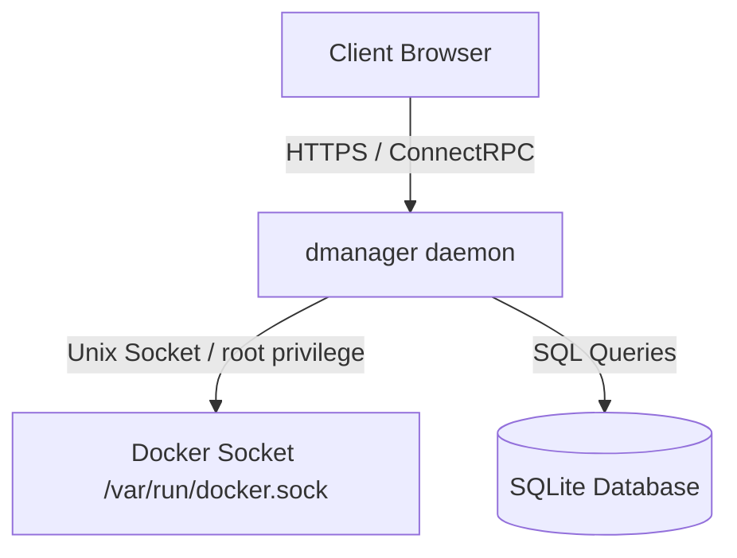

# Security Design & Audit Guidelines

This document outlines the security architecture, threat model, and validation checklists for the `dmanager` application. Because this application interacts directly with the host's Docker socket, maintaining strict security boundaries is critical.

---

## 1. Threat Model & Security Boundaries

### 1.1. Host System Control (Privilege Escalation)
* **Risk:** The Docker daemon socket `/var/run/docker.sock` allows full root-level control over the host system. Anyone who can execute arbitrary Docker commands can mount host root directories and escalate privileges.
* **Mitigation:**
  * The Docker socket must never be exposed directly to the network or the frontend.
  * Only the `dmanager` Go backend communicates with the socket.
  * Every backend endpoint that interacts with the Docker SDK must enforce strict user authentication and authorization checks.

### 1.2. Onboarding & Setup Bypass
* **Risk:** An attacker could invoke the administrator onboarding endpoint (`SetupAdmin`) on a running server to create a secondary admin account or override credentials.
* **Mitigation:**
  * The `SetupAdmin` handler must query the SQLite database first. If the `users` table contains one or more records, the server must reject the call immediately with a `FailedPrecondition` error (Status Code: `9`).

---

## 2. Authentication & Session Management

### 2.1. Password Hashing
* **Standard:** All passwords must be hashed using **bcrypt** with a minimum work factor (cost) of `12`.
* **Verification:** Raw passwords must never be stored in the database or logged under any circumstances.

### 2.2. Session Token Generation & Two-Clock Lifecycle
* **Standard:** Session identifiers must be generated using a cryptographically secure random number generator (`crypto/rand` in Go) with a length of 32 bytes, encoded as a 64-character hexadecimal string.
* **Storage & Lifetimes:**
  * Sessions are governed by a two-clock model: a sliding idle timeout (`expires_at`, default: 7 days, 30 days for "Remember me") and an absolute expiry cap (`absolute_expires_at`, default: 30 days, 90 days for "Remember me").
  * Sliding activity updates occur lazily (only after half of the idle timeout has elapsed) to minimize database write churn.
  * Expired sessions (by either idle or absolute deadline) are rejected upon access and cleaned up by a recurring background purge job.

### 2.3. Transport Cookies
* **Standard:** The session token must be transmitted via HTTP headers using `Set-Cookie`.
* **Cookie Flags:**
  * `HttpOnly`: Prevents client-side scripts (XSS) from reading the token.
  * `Secure`: Configurable mode (`auto`, `always`, `never`). In `auto` mode, enforced whenever the request is served over HTTPS or carries `X-Forwarded-Proto: https`.
  * `SameSite=Lax`: Mitigates Cross-Site Request Forgery (CSRF) while allowing normal top-level navigations.
  * `Max-Age`: Matches the idle session timeout to synchronize browser-side and server-side expiration.
  * `Path=/`: Restricts cookie scope to the root path.

---

## 3. Authorization & Access Control (RBAC)

### 3.1. User Roles
The system supports two user roles:
1. `admin`: Has full privileges to list, start, stop, configure, and upgrade containers, as well as purge logs.
2. `viewer`: Read-only access to view the dashboard and stream logs. Cannot trigger container state transitions or write updates.

### 3.2. Endpoint Access Control Matrix

| Endpoint | Service | Minimum Role | Authentication |
| :--- | :--- | :--- | :--- |
| `GetServerStatus` | `AuthService` | None | Unauthenticated |
| `SetupAdmin` | `AuthService` | None | Unauthenticated (Only if user count is 0) |
| `Login` | `AuthService` | None | Unauthenticated |
| `Logout` | `AuthService` | `viewer` | Authenticated |
| `GetMe` | `AuthService` | `viewer` | Authenticated |
| `ListContainers` | `ContainerService` | `viewer` | Authenticated |
| `GetContainerLogs` | `ContainerService` | `viewer` | Authenticated |
| `StartContainer` | `ContainerService` | `admin` | Authenticated + Admin |
| `StopContainer` | `ContainerService` | `admin` | Authenticated + Admin |
| `SetContainerAutoUpdate` | `ContainerService` | `admin` | Authenticated + Admin |
| `CheckContainerUpdates` | `ContainerService` | `admin` | Authenticated + Admin |
| `SyncLogs` | `LogService` | None | Unauthenticated / Authenticated |

---

## 4. Input Validation & Injection Defenses

### 4.1. Command Injection Prevention
* **Standard:** `dmanager` must never execute shell commands (e.g. `exec.Command("docker", ...)`) with user-supplied arguments.
* **Implementation:** Always interact with Docker using the official structured Go **Docker SDK** client.

### 4.2. Container ID Validation
* **Standard:** All endpoints receiving container IDs (like `StartContainerRequest.id`) must validate that the ID matches a standard Docker SHA256 hex string pattern (64 characters, `^[a-fA-F0-9]{64}$`) or a valid container name before passing it to SDK functions.

### 4.3. SQL Injection Prevention
* **Standard:** Direct string concatenation of SQL commands is strictly forbidden.
* **Implementation:** All queries must be executed using SQLC parameter binding (`?` placeholders).

---

## 5. Security Checklists for Code Review

Before committing any feature branch, verify the following checks:

### Go Backend (Security Checklist)
- [ ] No raw passwords are logged.
- [ ] Password comparisons are executed using `bcrypt.CompareHashAndPassword`.
- [ ] DB queries use generated SQLC parameters (no raw string formatting in SQL).
- [ ] Connect interceptor verifies session cookie on all protected routes and rejects requests with `Unauthenticated`.
- [ ] Admin actions explicitly check that `User.Role == "admin"` and reject unauthorized users with `PermissionDenied`.
- [ ] SetupAdmin checks `CountUsers` first.
- [ ] Static security checks pass: `golangci-lint run` (specifically runs `gosec`).

### Frontend (Security Checklist)
- [ ] Cookies are managed entirely via backend `HttpOnly` flags (no manual token reads in client javascript).
- [ ] Input fields enforce maximum lengths to prevent buffer or DOS anomalies.
- [ ] Dynamic markup avoids `dangerouslySetInnerHTML` unless explicitly sanitized.
- [ ] All biome security checks pass successfully: `pnpm biome check`.
