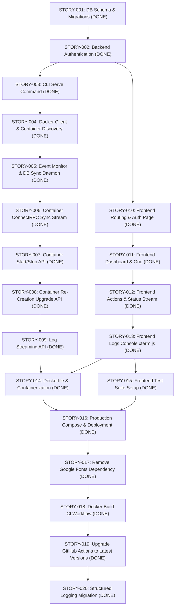

# AI Agent Feature Stories Roadmap

This document outlines the development plan for the `dmanager` application. The stories are designed to be bite-sized (typically < 300 lines of code changed per PR) and logically sequenced so that dependencies are met first. Each story includes strict validation checks to verify implementation correctness.

---

## Backend Stories

### STORY-001: DB Schema, Migration Setup & SQLC CodeGen [DONE]
- **Scope:** Backend Database Infrastructure
- **Estimated Size:** Small (~100 LOC)
- **Dependencies:** None
- **Token Estimate:** Input: ~50k | Output: ~3k | Total: ~53k (Actual: ~52k)
- **Goal:** Set up the database migrations framework and generate initial SQL query wrappers using goose and SQLC.
- **Tasks:**
  1. Create database migration script `internal/db/migrations/00001_init.sql` based on [docs/schema.md](file:///home/mechsoull/Projects/dmanager/docs/schema.md).
  2. Configure SQLC via `sqlc.yaml` in the root (matching SQLite driver rules).
  3. Create SQL queries in `internal/db/queries/` (`users.sql`, `sessions.sql`, `containers.sql`).
  4. Generate Go queries code using `sqlc generate`.
- **Files Affected:**
  - `internal/db/migrations/00001_init.sql` (new)
  - `sqlc.yaml` (new)
  - `internal/db/queries/users.sql`, `internal/db/queries/sessions.sql`, `internal/db/queries/containers.sql` (new)
  - `internal/db/db.go` (new wrapper to open SQLite with CGO-free driver `ncruces/go-sqlite3`)
- **Validation Check:**
  - Run `go generate ./...` or `sqlc generate`.
  - Validate that the generated files compile successfully.
  - Verify formatting and linting: `golangci-lint run`.

---

### STORY-002: Backend Authentication Services [DONE]
- **Scope:** Backend Security & DB
- **Estimated Size:** Medium (~250 LOC)
- **Dependencies:** `STORY-001`
- **Token Estimate:** Input: ~90k | Output: ~6k | Total: ~96k (Actual: ~95k)
- **Goal:** Implement secure session-based authentication handlers using ConnectRPC.
- **Tasks:**
  1. Implement `AuthService` interface defined in [docs/protocol.md](file:///home/mechsoull/Projects/dmanager/docs/protocol.md).
  2. Implement `Login` (verify credentials, hash checks with bcrypt, store session in DB, return token).
  3. Implement `GetCurrentUser` (parse Authorization token, fetch session, return user payload).
  4. Implement `Logout` (invalidate session token in DB).
  5. Set up ConnectRPC auth interceptor/middleware.
- **Files Affected:**
  - `internal/auth/service.go` (new)
  - `internal/auth/interceptor.go` (new middleware)
  - `internal/auth/service_test.go` (new unit tests)
- **Validation Check:**
  - Run unit tests: `go test -v ./internal/auth/...`
  - Verify zero linter warnings: `golangci-lint run`.

---

### STORY-003: Cobra Serve Command & Server Bootstrap [DONE]
- **Scope:** CLI & Server Setup
- **Estimated Size:** Small (~150 LOC)
- **Dependencies:** `STORY-002`
- **Token Estimate:** Input: ~45k - 60k | Output: ~2k - 3k | Total: ~47k - 63k
- **Goal:** Add the `serve` command to the Cobra CLI, parsing configuration and starting the HTTP/gRPC-web server.
- **Tasks:**
  1. Create a `cmd/serve.go` sub-command under cobra.
  2. Initialize Koanf configuration parser (reading configs from `/etc/dmanager/config.yaml` or env).
  3. Bootstrap Echo v5 (or standard multiplexer) listening on configured port.
  4. Register ConnectRPC handlers (`AuthService`).
- **Files Affected:**
  - `cmd/serve.go` (new)
  - `internal/config/config.go` (new config manager)
- **Validation Check:**
  - Compile application: `go build -o dmanager .`
  - Start daemon locally: `./dmanager serve --help`
  - Run linter verification.

---

### STORY-004: Docker Client Setup & Basic Container Listing [DONE]
- **Scope:** Docker Integration
- **Estimated Size:** Small (~150 LOC)
- **Dependencies:** `STORY-003`
- **Token Estimate:** Input: ~50k - 70k | Output: ~3k - 4k | Total: ~53k - 74k
- **Goal:** Initialize the standard Docker SDK client and provide a simple non-streaming API to query local container metadata.
- **Tasks:**
  1. Add Docker SDK Go package dependency.
  2. Initialize Docker Client inside background context (listening on local unix socket).
  3. Implement the backend container listing RPC (`ListContainers`) to return discovered local Docker containers.
- **Files Affected:**
  - `internal/docker/client.go` (new Docker wrapper)
  - `internal/container/service.go` (implement list container RPC)
- **Validation Check:**
  - Mock docker tests: `go test -v ./internal/container/...`
  - Ensure `go build` passes.

---

### STORY-005: Docker Event Monitor & Database Sync Daemon [DONE]
- **Scope:** Daemon / Synchronization
- **Estimated Size:** Medium (~250 LOC)
- **Dependencies:** `STORY-004`
- **Token Estimate:** Input: ~75k - 100k | Output: ~5k - 7k | Total: ~80k - 107k
- **Goal:** Implement a long-running background monitor that listens to Docker events API, processes container changes, and syncs container states into the SQLite database.
- **Tasks:**
  1. Implement background daemon thread initialized at server startup.
  2. Listen to Docker Events stream (`Events(ctx, ...)`).
  3. On container create, start, stop, destroy, or die events, query container details and write updates to the `containers` database table.
- **Files Affected:**
  - `internal/docker/monitor.go` (new background sync daemon)
- **Validation Check:**
  - Run unit and mock database transaction tests.
  - Compile and verify formatting.

---

### STORY-006: Container ConnectRPC Sync Stream [DONE]
- **Scope:** API / Real-Time Streaming
- **Estimated Size:** Medium (~200 LOC)
- **Dependencies:** `STORY-005`
- **Token Estimate:** Input: ~80k - 110k | Output: ~5k - 8k | Total: ~85k - 118k
- **Goal:** Expose the real-time container states stream via ConnectRPC server streaming.
- **Tasks:**
  1. Implement `StreamContainers` server stream handler.
  2. Set up internal Pub/Sub pattern (or channels) where the background Docker monitor publishes updates, and the streaming handler pushes events to active clients.
- **Files Affected:**
  - `internal/container/stream.go` (stream endpoint logic)
- **Validation Check:**
  - Test streaming channels with mock events.
  - Check with `golangci-lint run`.

---

### STORY-007: Container Start/Stop API Operations [DONE]
- **Scope:** Container Operations
- **Estimated Size:** Small (~150 LOC)
- **Dependencies:** `STORY-004`
- **Token Estimate:** Input: ~60k - 80k | Output: ~3k - 5k | Total: ~63k - 85k
- **Goal:** Support remote command actions to start or stop targeted containers using the Docker SDK.
- **Tasks:**
  1. Implement `StartContainer` ConnectRPC handler invoking Docker API.
  2. Implement `StopContainer` ConnectRPC handler invoking Docker API (with timeout parameters).
  3. Handle errors securely and verify authorization rules.
- **Files Affected:**
  - `internal/container/actions.go` (start/stop methods)
- **Validation Check:**
  - Run action mock unit tests.

---

### STORY-008: Container Re-Creation Upgrade API [DONE]
- **Scope:** Docker Integration
- **Estimated Size:** Large (~300 LOC)
- **Dependencies:** `STORY-007`
- **Token Estimate:** Input: ~120k - 160k | Output: ~8k - 12k | Total: ~128k - 172k
- **Goal:** Implement the "Upgrade Container" operation, pulling the latest tag digest and re-creating the container with exact parameters preserved.
- **Tasks:**
  1. Implement `UpgradeContainer` RPC.
  2. Query existing container settings via `ContainerInspect` (preserve Envs, Ports, Binds, Volumes, Labels, Networks).
  3. Pull latest image tag digest (`ImagePull`).
  4. Stop and delete the old container.
  5. Re-create using the stored parameters and start the new instance.
- **Files Affected:**
  - `internal/container/upgrade.go` (re-create logic)
- **Validation Check:**
  - Unit tests verifying recreation parameter preservation mapping.

---

### STORY-009: Log Streaming & Tailing API [DONE]
- **Scope:** Real-Time Streams
- **Estimated Size:** Medium (~200 LOC)
- **Dependencies:** `STORY-004`
- **Token Estimate:** Input: ~70k - 90k | Output: ~4k - 6k | Total: ~74k - 96k
- **Goal:** Establish a streaming handler that yields stdout/stderr logs of a container over ConnectRPC.
- **Tasks:**
  1. Implement `StreamLogs` server stream.
  2. Call Docker SDK `ContainerLogs` requesting tail values and active stdout/stderr streams.
  3. Map chunk bytes to Protobuf stream responses and stream back to client.
- **Files Affected:**
  - `internal/container/logs.go` (log streaming endpoint)
- **Validation Check:**
  - Unit tests running reader mock buffers.

---

## Frontend Stories

### STORY-010: Frontend Routing & Login Page [DONE]
- **Scope:** Frontend Auth
- **Estimated Size:** Medium (~250 LOC)
- **Dependencies:** `STORY-002`
- **Token Estimate:** Input: ~80k - 120k | Output: ~6k - 9k | Total: ~86k - 129k
- **Goal:** Initialize React Router, design a premium glassmorphic login interface, and store the authentication token.
- **Tasks:**
  1. Set up TanStack Router rules (protected dashboard routes vs. public login route).
  2. Implement premium, clean Login component with fields validation.
  3. Add auth hooks to manage API credentials and store token in localStorage.
- **Files Affected:**
  - `frontend/src/routes/router.tsx` (navigation routes configuration)
  - `frontend/src/components/Login.tsx` (new premium login view)
  - `frontend/src/components/Setup.tsx` (new premium onboarding setup view)
  - `frontend/src/hooks/useAuth.tsx` (state management)
- **Validation Check:**
  - Run Biome linters and formatting checks: `pnpm biome check .`
  - Compile React build: `pnpm build`

---

### STORY-011: Frontend Dashboard Layout & Container Grid [DONE]
- **Scope:** Frontend UI
- **Estimated Size:** Large (~350 LOC)
- **Dependencies:** `STORY-010`
- **Token Estimate:** Input: ~140k - 180k | Output: ~9k - 13k | Total: ~149k - 193k
- **Goal:** Build the main dashboard framework displaying a premium grid view of discovered containers with status cards.
- **Tasks:**
  1. Create navigation sidebar (dashboard links, user actions, profile card).
  2. Create Container Grid displaying container name, image tag, status badges (running/stopped/updating), and action buttons.
  3. Implement local filtering and search functionality.
- **Files Affected:**
  - `frontend/src/components/DashboardLayout.tsx` (main shell)
  - `frontend/src/components/ContainerGrid.tsx` (grid rendering)
- **Validation Check:**
  - Biome checks and Vite production build compilation.

---

### STORY-012: Frontend Actions & Real-time Status Stream Integration [DONE]
- **Scope:** Frontend State
- **Estimated Size:** Medium (~250 LOC)
- **Dependencies:** `STORY-006`, `STORY-007`
- **Token Estimate:** Input: ~90k - 130k | Output: ~5k - 8k | Total: ~95k - 138k
- **Goal:** Integrate ConnectRPC clients to stream real-time updates and trigger container actions (start/stop).
- **Tasks:**
  1. Add `@connectrpc/connect` and transport configs.
  2. Setup hook to subscribe to `StreamContainers` and patch the React state when updates arrive.
  3. Connect action buttons to trigger `StartContainer` / `StopContainer` endpoints.
- **Files Affected:**
  - `frontend/src/hooks/useContainers.ts` (stream binding)
- **Validation Check:**
  - Verification using Vitest + Mock Service Worker (MSW) or stubbed RPC mock responses.

---

### STORY-013: Frontend Logs Terminal Console [DONE]
- **Scope:** Frontend UI
- **Estimated Size:** Medium (~200 LOC)
- **Dependencies:** `STORY-009`
- **Token Estimate:** Input: ~80k - 110k | Output: ~4k - 7k | Total: ~84k - 117k
- **Goal:** Build a container logs console drawer using `xterm.js` to render streamed terminal outputs.
- **Tasks:**
  1. Install `xterm` and `@xterm/addon-fit`.
  2. Create a logs drawer/modal component with a black, monospaced terminal environment.
  3. Bind `StreamLogs` RPC stream directly to write incoming chunks to the xterm buffer.
- **Files Affected:**
  - `frontend/src/components/LogsDrawer.tsx` (terminal UI wrapper)
- **Validation Check:**
  - Compile frontend cleanly, verify Biome check passes.

---

### STORY-014: Dockerfile & Containerization [DONE]
- **Scope:** Deployment & Process Control
- **Estimated Size:** Small (~100 LOC)
- **Dependencies:** `STORY-009`, `STORY-013`
- **Token Estimate:** Input: ~50k | Output: ~3k | Total: ~53k
- **Goal:** Set up a multi-stage Dockerfile to build the frontend and backend, package them into a lightweight Alpine image with s6-overlay, and verify execution.
- **Tasks:**
  1. Create a root `Dockerfile` using multi-stage builds (`node:24-alpine`, `golang:alpine`, and `alpine:latest`).
  2. Configure `s6-overlay` in the runtime image to supervise the `dmanager` process using the embedded configuration in `rootfs/`.
  3. Verify local build works by compiling and starting the container with the docker socket mounted.
- **Files Affected:**
  - `Dockerfile` (new)
- **Validation Check:**
  - Build the docker image locally.
  - Run the built image checking s6-overlay starts up `dmanager` successfully.

---

### STORY-015: Frontend Test Suite Setup & Component Testing [DONE]
- **Scope:** Frontend Testing
- **Estimated Size:** Medium (~250 LOC)
- **Dependencies:** `STORY-011`, `STORY-013`
- **Token Estimate:** Input: ~60k | Output: ~4k | Total: ~64k
- **Goal:** Set up Vitest, React Testing Library, and MSW for the React frontend, and write component/integration tests for critical views.
- **Tasks:**
  1. Add devDependencies for `vitest`, `@testing-library/react`, `@testing-library/jest-dom`, `@testing-library/user-event`, `jsdom`, and `msw` in `frontend/package.json`.
  2. Configure Vitest in `frontend/vite.config.ts` (using `jsdom` environment and global test setups).
  3. Create test files for critical components (e.g. `Login.test.tsx` and custom hook tests or a setup file) asserting basic UI functionality, interactions, and mocked responses.
- **Files Affected:**
  - `frontend/package.json` (modified)
  - `frontend/vite.config.ts` (modified)
  - `frontend/src/setupTests.ts` (new setup file)
  - `frontend/src/components/Login.test.tsx` (new test)
- **Validation Check:**
  - Run `pnpm test` (or `vitest run`) inside the frontend directory, ensuring all tests pass successfully.

---

### STORY-016: Production Compose & Deployment [DONE]
- **Scope:** Deployment & Operations
- **Estimated Size:** Small (~100 LOC)
- **Dependencies:** `STORY-014`, `STORY-015`
- **Token Estimate:** Input: ~40k | Output: ~2k | Total: ~42k
- **Goal:** Set up a production Docker Compose configuration file and draft a clear deployment verification checklist document.
- **Tasks:**
  1. Create a root-level `docker-compose.yml` supporting restart policies, persistent volumes, environment overrides, and the unix socket bridge.
  2. Create a `docs/deployment.md` document outlining requirements, configurations, and docker run commands.
- **Files Affected:**
  - `docker-compose.yml` (new)
  - `docs/deployment.md` (new)
- **Validation Check:**
  - Verify that `docker compose config` passes successfully.

---

### STORY-017: Remove Google Fonts Dependency [DONE]
- **Scope:** Frontend Assets & Styling
- **Estimated Size:** Small (~50 LOC)
- **Dependencies:** `STORY-015`
- **Token Estimate:** Input: ~30k | Output: ~2k | Total: ~32k
- **Goal:** Remove Google Fonts external runtime dependency by packaging and self-hosting Plus Jakarta Sans and JetBrains Mono fonts locally.
- **Tasks:**
  1. Install Fontsource npm packages for Plus Jakarta Sans and JetBrains Mono in the frontend directory.
  2. Update `frontend/src/index.css` to import local stylesheets instead of fetching fonts from `fonts.googleapis.com`.
  3. Validate frontend builds and test execution.
- **Files Affected:**
  - `frontend/package.json` (modified)
  - `frontend/src/index.css` (modified)
- **Validation Check:**
  - Run Biome linters: `pnpm biome check .`
  - Compile frontend build: `pnpm build`
  - Run frontend test suite: `pnpm test`

---

### STORY-018: Docker Build CI Workflow [DONE]
- **Scope:** CI/CD & Infrastructure
- **Estimated Size:** Small (~50 LOC)
- **Dependencies:** `STORY-016`, `STORY-017`
- **Token Estimate:** Input: ~30k | Output: ~2k | Total: ~32k
- **Goal:** Add a new CI workflow "docker" triggered on pushes/pull requests to main to build the Docker image for both amd64 and arm64 platforms.
- **Tasks:**
  1. Add `.github/workflows/docker.yml` workflow triggered on push/PR to `main` branch.
  2. Implement build strategy using a platform matrix for `linux/amd64` and `linux/arm64`.
  3. Configure QEMU support for the `linux/arm64` platform matrix run.
  4. Use Docker build-push action to build the image (without pushing).
- **Files Affected:**
  - `.github/workflows/docker.yml` (new)
- **Validation Check:**
  - Verify workflow YAML structure is correct.

---

### STORY-019: Upgrade GitHub Actions to Latest Versions [DONE]
- **Scope:** CI/CD & Infrastructure
- **Estimated Size:** Small (~50 LOC)
- **Dependencies:** `STORY-018`
- **Token Estimate:** Input: ~30k | Output: ~2k | Total: ~32k
- **Goal:** Upgrade all GitHub Actions used in workflows to their latest stable major versions (checkout to v7, setup-qemu-action to v4, setup-buildx-action to v4, build-push-action to v7, action-setup to v6) and search web to verify compatibility.
- **Tasks:**
  1. Update `.github/workflows/backend.yml` (upgrade actions/checkout to v7).
  2. Update `.github/workflows/docker.yml` (upgrade actions/checkout to v7, setup-qemu-action to v4, setup-buildx-action to v4, build-push-action to v7).
  3. Update `.github/workflows/frontend.yml` (upgrade actions/checkout to v7, action-setup to v6).
- **Files Affected:**
  - `.github/workflows/backend.yml` (modified)
  - `.github/workflows/docker.yml` (modified)
  - `.github/workflows/frontend.yml` (modified)
- **Validation Check:**
  - Verify all GitHub workflows pass parsing/validation check.

---

### STORY-020: Structured Logging Migration [DONE]
- **Scope:** Backend Infrastructure
- **Estimated Size:** Medium (~150 LOC)
- **Dependencies:** `STORY-003`, `STORY-005`
- **Token Estimate:** Input: ~35k | Output: ~2k | Total: ~37k
- **Goal:** Migrate the backend from standard `log` library to structured logging using `log/slog` with module-scoped attributes.
- **Tasks:**
  1. Initialize the global `slog` handler in `cmd/serve.go`.
  2. Replace standard `log` library print usages in `cmd/serve.go` and `internal/docker/monitor.go` with contextual `slog` methods (e.g. `slog.Info`, `slog.Error`).
  3. Ensure module-scoped loggers (e.g., using `logger.With("module", "module_name")`) are instantiated and passed to backend components.
- **Files Affected:**
  - `cmd/serve.go` (modified)
  - `internal/docker/monitor.go` (modified)
- **Validation Check:**
  - Run compiler checking: `go build` / `go vet ./...`
  - Verify formatting and linting: `golangci-lint run`
  - Run all Go tests to verify everything compiles and runs successfully.

