# AI Agent Feature Stories Roadmap

This document outlines the development plan for the `dmanager` application. The stories are designed to be bite-sized (typically < 300 lines of code changed per PR) and logically sequenced so that dependencies are met first. Each story includes strict validation checks to verify implementation correctness.

```mermaid
graph TD
    S1["STORY-001: DB Schema & Migrations (DONE)"] --> S2["STORY-002: Backend Authentication (DONE)"]
    S2 --> S3["STORY-003: CLI Serve Command (DONE)"]
    S3 --> S4["STORY-004: Docker Client & Container Discovery (DONE)"]
    S4 --> S5["STORY-005: Event Monitor & DB Sync Daemon (DONE)"]
    S5 --> S6["STORY-006: Container ConnectRPC Sync Stream (DONE)"]
    S6 --> S7["STORY-007: Container Start/Stop API (DONE)"]
    S7 --> S8["STORY-008: Container Re-Creation Upgrade API (DONE)"]
    S8 --> S9["STORY-009: Log Streaming API (DONE)"]
    S2 --> F1["STORY-010: Frontend Routing & Auth Page (DONE)"]
    F1 --> F2["STORY-011: Frontend Dashboard & Grid (DONE)"]
    F2 --> F3["STORY-012: Frontend Actions & Status Stream (DONE)"]
    F3 --> F4["STORY-013: Frontend Logs Console xterm.js (DONE)"]
    S9 --> S14["STORY-014: Dockerfile & Containerization (DONE)"]
    F4 --> S14
    F4 --> F5["STORY-015: Frontend Test Suite Setup (DONE)"]
    S14 --> S16["STORY-016: Production Compose & Deployment (DONE)"]
    F5 --> S16
    S16 --> F17["STORY-017: Remove Google Fonts Dependency (DONE)"]
    F17 --> S18["STORY-018: Docker Build CI Workflow (DONE)"]
    S18 --> S19["STORY-019: Upgrade GitHub Actions to Latest Versions (DONE)"]
    S19 --> S20["STORY-020: Structured Logging Migration (DONE)"]
    S20 --> S21["STORY-021: Version Tag Release Workflow (DONE)"]
    S21 --> S22["STORY-022: Implement Container Auto-Update and Check Updates RPCs (DONE)"]
    S22 --> S23["STORY-023: Periodic Registry Update Checker (DONE)"]
    S23 --> S24["STORY-024: Automated Container Re-Deployment Workflow (DONE)"]
    S24 --> S25["STORY-025: Improve Request and Action Logging (DONE)"]
    S25 --> S26["STORY-026: Enable Client-Server Binary Communication (DONE)"]
    S26 --> S27["STORY-027: Implement LogServiceHandler (DONE)"]
    S27 --> F28["STORY-028: Frontend Client-Side Logging Framework (DONE)"]
    F28 --> F29["STORY-029: System Logs Page Design and Implementation (DONE)"]
    F29 --> F30["STORY-030: Migrate Sidebar Logo to SVG Asset (DONE)"]
    F30 --> F31["STORY-031: Configure Build Pipeline Favicon Generation (DONE)"]
    F31 --> S32["STORY-032: DB Settings Migration, Repo & RPCs (DONE)"]
    S32 --> S33["STORY-033: Gotify Notification Dispatcher (DONE)"]
    S32 --> F34["STORY-034: Frontend Settings Web UI (DONE)"]
    F34 --> F35["STORY-035: Configure Frontend minimumReleaseAge (DONE)"]
    F35 --> F36["STORY-036: Configure Dependabot npm Cooldown (DONE)"]
    F36 --> S37["STORY-037: Configure Dependabot for GitHub Actions (DONE)"]
    S37 --> F38["STORY-038: Frontend Toast Notification System (DONE)"]
    F38 --> F39["STORY-039: Private Registry Status Monitoring (DONE)"]
    F39 --> F40["STORY-040: Frontend Table View and View Switcher (DONE)"]
    F40 --> S41["STORY-041: Eliminate QEMU from Multi-Architecture Docker Builds (DONE)"]
    S41 --> S42["STORY-042: Two-Clock Session Model & Sliding Renewal (DONE)"]
    S42 --> S43["STORY-043: Auth Configuration & Cookie Hardening (DONE)"]
    S42 --> S44["STORY-044: Background Purge Job for Expired Sessions (DONE)"]
    S44 --> S45["STORY-045: Connect Interceptor RBAC Enforcement & Procedure Coverage (DONE)"]
    S45 --> S46["STORY-046: Sliding Window Login Rate Limiting & Exponential Lockout (DONE)"]
    S46 --> S47["STORY-047: Timing Equalization, Password Policy & Breached Check (DONE)"]
    S45 --> S48["STORY-048: Require Authentication for LogService/SyncLogs (DONE)"]
    S45 --> S49["STORY-049: Auth Audit Trail Schema, Event Writes, and ListAuthEvents RPC"]
    S49 --> S50["STORY-050: Session Management RPCs, Device Identification & Settings Security Tab"]
    S50 --> S51["STORY-051: WebAuthn Foundation, Config, Dependencies, Schema & Lifecycle (DONE)"]
    S51 --> S52["STORY-052: Passkey Registration Ceremony, Credential Management & Settings UI (DONE)"]
    S52 --> S53["STORY-053: Passkey Usernameless Login Ceremony & Login UI (DONE)"]
    S53 --> A54["STORY-054: Administration Backend, AdminService Read-Only List RPCs (DONE)"]
    A54 --> A55["STORY-055: Administration Frontend, Tabs, Tables & Navigation (DONE)"]
    A55 --> A56["STORY-056: Administration Images Stat Cards & Size-First Sorting (DONE)"]
    A56 --> A57["STORY-057: Administration Image Deletion (Actions Column) (DONE)"]
    A57 --> A58["STORY-058: Engine Status Pill — Real Connectivity (issue #180) (DONE)"]
    A58 --> A59["STORY-059: Reusable Dialog System + ConfirmDialog (issue #176) (DONE)"]
    A59 --> A60["STORY-060: Image Delete via ConfirmDialog (#177) (DONE)"]
    A59 --> A61["STORY-061: Passkey & Destructive Confirmations (#178) (DONE)"]
    A61 --> A62["STORY-062: Administration Containers-Style Layout (#189) (DONE)"]
    A62 --> A63["STORY-063: Generic PageTabs & Settings Shell Refinement (#192) (DONE)"]
    A63 --> A64["STORY-064: Image Prune — Bulk Reclaim (#196) (DONE)"]
    A64 --> A65["STORY-065: Images Unused & Dangling Stat Cards (#200)"]
```

---

## Backend Stories

### STORY-001: DB Schema, Migration Setup & SQLC CodeGen [DONE]
- **Scope:** Backend Database Infrastructure
- **Estimated Size:** Small (~100 LOC)
- **Dependencies:** None
- **Token Estimate:** Input: ~50k | Output: ~3k | Total: ~53k (Actual: ~52k)
- **Goal:** Set up the database migrations framework and generate initial SQL query wrappers using goose and SQLC.
- **Tasks:**
  1. Create database migration script `internal/db/migrations/00001_init.sql` based on [docs/schema.md](file:///home/mechsoull/Projects/dmanager/docs/schema.md).
  2. Configure SQLC via `sqlc.yaml` in the root (matching SQLite driver rules).
  3. Create SQL queries in `internal/db/queries/` (`users.sql`, `sessions.sql`, `containers.sql`).
  4. Generate Go queries code using `sqlc generate`.
- **Files Affected:**
  - `internal/db/migrations/00001_init.sql` (new)
  - `sqlc.yaml` (new)
  - `internal/db/queries/users.sql`, `internal/db/queries/sessions.sql`, `internal/db/queries/containers.sql` (new)
  - `internal/db/db.go` (new wrapper to open SQLite with CGO-free driver `ncruces/go-sqlite3`)
- **Validation Check:**
  - Run `go generate ./...` or `sqlc generate`.
  - Validate that the generated files compile successfully.
  - Verify formatting and linting: `golangci-lint run`.

---

### STORY-002: Backend Authentication Services [DONE]
- **Scope:** Backend Security & DB
- **Estimated Size:** Medium (~250 LOC)
- **Dependencies:** `STORY-001`
- **Token Estimate:** Input: ~90k | Output: ~6k | Total: ~96k (Actual: ~95k)
- **Goal:** Implement secure session-based authentication handlers using ConnectRPC.
- **Tasks:**
  1. Implement `AuthService` interface defined in [docs/protocol.md](file:///home/mechsoull/Projects/dmanager/docs/protocol.md).
  2. Implement `Login` (verify credentials, hash checks with bcrypt, store session in DB, return token).
  3. Implement `GetCurrentUser` (parse Authorization token, fetch session, return user payload).
  4. Implement `Logout` (invalidate session token in DB).
  5. Set up ConnectRPC auth interceptor/middleware.
- **Files Affected:**
  - `internal/auth/service.go` (new)
  - `internal/auth/interceptor.go` (new middleware)
  - `internal/auth/service_test.go` (new unit tests)
- **Validation Check:**
  - Run unit tests: `go test -v ./internal/auth/...`
  - Verify zero linter warnings: `golangci-lint run`.

---

### STORY-003: Cobra Serve Command & Server Bootstrap [DONE]
- **Scope:** CLI & Server Setup
- **Estimated Size:** Small (~150 LOC)
- **Dependencies:** `STORY-002`
- **Token Estimate:** Input: ~45k - 60k | Output: ~2k - 3k | Total: ~47k - 63k
- **Goal:** Add the `serve` command to the Cobra CLI, parsing configuration and starting the HTTP/gRPC-web server.
- **Tasks:**
  1. Create a `cmd/serve.go` sub-command under cobra.
  2. Initialize Koanf configuration parser (reading configs from `/etc/dmanager/config.yaml` or env).
  3. Bootstrap Echo v5 (or standard multiplexer) listening on configured port.
  4. Register ConnectRPC handlers (`AuthService`).
- **Files Affected:**
  - `cmd/serve.go` (new)
  - `internal/config/config.go` (new config manager)
- **Validation Check:**
  - Compile application: `go build -o dmanager .`
  - Start daemon locally: `./dmanager serve --help`
  - Run linter verification.

---

### STORY-004: Docker Client Setup & Basic Container Listing [DONE]
- **Scope:** Docker Integration
- **Estimated Size:** Small (~150 LOC)
- **Dependencies:** `STORY-003`
- **Token Estimate:** Input: ~50k - 70k | Output: ~3k - 4k | Total: ~53k - 74k
- **Goal:** Initialize the standard Docker SDK client and provide a simple non-streaming API to query local container metadata.
- **Tasks:**
  1. Add Docker SDK Go package dependency.
  2. Initialize Docker Client inside background context (listening on local unix socket).
  3. Implement the backend container listing RPC (`ListContainers`) to return discovered local Docker containers.
- **Files Affected:**
  - `internal/docker/client.go` (new Docker wrapper)
  - `internal/container/service.go` (implement list container RPC)
- **Validation Check:**
  - Mock docker tests: `go test -v ./internal/container/...`
  - Ensure `go build` passes.

---

### STORY-005: Docker Event Monitor & Database Sync Daemon [DONE]
- **Scope:** Daemon / Synchronization
- **Estimated Size:** Medium (~250 LOC)
- **Dependencies:** `STORY-004`
- **Token Estimate:** Input: ~75k - 100k | Output: ~5k - 7k | Total: ~80k - 107k
- **Goal:** Implement a long-running background monitor that listens to Docker events API, processes container changes, and syncs container states into the SQLite database.
- **Tasks:**
  1. Implement background daemon thread initialized at server startup.
  2. Listen to Docker Events stream (`Events(ctx, ...)`).
  3. On container create, start, stop, destroy, or die events, query container details and write updates to the `containers` database table.
- **Files Affected:**
  - `internal/docker/monitor.go` (new background sync daemon)
- **Validation Check:**
  - Run unit and mock database transaction tests.
  - Compile and verify formatting.

---

### STORY-006: Container ConnectRPC Sync Stream [DONE]
- **Scope:** API / Real-Time Streaming
- **Estimated Size:** Medium (~200 LOC)
- **Dependencies:** `STORY-005`
- **Token Estimate:** Input: ~80k - 110k | Output: ~5k - 8k | Total: ~85k - 118k
- **Goal:** Expose the real-time container states stream via ConnectRPC server streaming.
- **Tasks:**
  1. Implement `StreamContainers` server stream handler.
  2. Set up internal Pub/Sub pattern (or channels) where the background Docker monitor publishes updates, and the streaming handler pushes events to active clients.
- **Files Affected:**
  - `internal/container/stream.go` (stream endpoint logic)
- **Validation Check:**
  - Test streaming channels with mock events.
  - Check with `golangci-lint run`.

---

### STORY-007: Container Start/Stop API Operations [DONE]
- **Scope:** Container Operations
- **Estimated Size:** Small (~150 LOC)
- **Dependencies:** `STORY-004`
- **Token Estimate:** Input: ~60k - 80k | Output: ~3k - 5k | Total: ~63k - 85k
- **Goal:** Support remote command actions to start or stop targeted containers using the Docker SDK.
- **Tasks:**
  1. Implement `StartContainer` ConnectRPC handler invoking Docker API.
  2. Implement `StopContainer` ConnectRPC handler invoking Docker API (with timeout parameters).
  3. Handle errors securely and verify authorization rules.
- **Files Affected:**
  - `internal/container/actions.go` (start/stop methods)
- **Validation Check:**
  - Run action mock unit tests.

---

### STORY-008: Container Re-Creation Upgrade API [DONE]
- **Scope:** Docker Integration
- **Estimated Size:** Large (~300 LOC)
- **Dependencies:** `STORY-007`
- **Token Estimate:** Input: ~120k - 160k | Output: ~8k - 12k | Total: ~128k - 172k
- **Goal:** Implement the "Upgrade Container" operation, pulling the latest tag digest and re-creating the container with exact parameters preserved.
- **Tasks:**
  1. Implement `UpgradeContainer` RPC.
  2. Query existing container settings via `ContainerInspect` (preserve Envs, Ports, Binds, Volumes, Labels, Networks).
  3. Pull latest image tag digest (`ImagePull`).
  4. Stop and delete the old container.
  5. Re-create using the stored parameters and start the new instance.
- **Files Affected:**
  - `internal/container/upgrade.go` (re-create logic)
- **Validation Check:**
  - Unit tests verifying recreation parameter preservation mapping.

---

### STORY-009: Log Streaming & Tailing API [DONE]
- **Scope:** Real-Time Streams
- **Estimated Size:** Medium (~200 LOC)
- **Dependencies:** `STORY-004`
- **Token Estimate:** Input: ~70k - 90k | Output: ~4k - 6k | Total: ~74k - 96k
- **Goal:** Establish a streaming handler that yields stdout/stderr logs of a container over ConnectRPC.
- **Tasks:**
  1. Implement `StreamLogs` server stream.
  2. Call Docker SDK `ContainerLogs` requesting tail values and active stdout/stderr streams.
  3. Map chunk bytes to Protobuf stream responses and stream back to client.
- **Files Affected:**
  - `internal/container/logs.go` (log streaming endpoint)
- **Validation Check:**
  - Unit tests running reader mock buffers.

---

## Frontend Stories

### STORY-010: Frontend Routing & Login Page [DONE]
- **Scope:** Frontend Auth
- **Estimated Size:** Medium (~250 LOC)
- **Dependencies:** `STORY-002`
- **Token Estimate:** Input: ~80k - 120k | Output: ~6k - 9k | Total: ~86k - 129k
- **Goal:** Initialize React Router, design a premium glassmorphic login interface, and store the authentication token.
- **Tasks:**
  1. Set up TanStack Router rules (protected dashboard routes vs. public login route).
  2. Implement premium, clean Login component with fields validation.
  3. Add auth hooks to manage API credentials and store token in localStorage.
- **Files Affected:**
  - `frontend/src/routes/router.tsx` (navigation routes configuration)
  - `frontend/src/components/Login.tsx` (new premium login view)
  - `frontend/src/components/Setup.tsx` (new premium onboarding setup view)
  - `frontend/src/hooks/useAuth.tsx` (state management)
- **Validation Check:**
  - Run Biome linters and formatting checks: `pnpm biome check .`
  - Compile React build: `pnpm build`

---

### STORY-011: Frontend Dashboard Layout & Container Grid [DONE]
- **Scope:** Frontend UI
- **Estimated Size:** Large (~350 LOC)
- **Dependencies:** `STORY-010`
- **Token Estimate:** Input: ~140k - 180k | Output: ~9k - 13k | Total: ~149k - 193k
- **Goal:** Build the main dashboard framework displaying a premium grid view of discovered containers with status cards.
- **Tasks:**
  1. Create navigation sidebar (dashboard links, user actions, profile card).
  2. Create Container Grid displaying container name, image tag, status badges (running/stopped/updating), and action buttons.
  3. Implement local filtering and search functionality.
- **Files Affected:**
  - `frontend/src/components/DashboardLayout.tsx` (main shell)
  - `frontend/src/components/ContainerGrid.tsx` (grid rendering)
- **Validation Check:**
  - Biome checks and Vite production build compilation.

---

### STORY-012: Frontend Actions & Real-time Status Stream Integration [DONE]
- **Scope:** Frontend State
- **Estimated Size:** Medium (~250 LOC)
- **Dependencies:** `STORY-006`, `STORY-007`
- **Token Estimate:** Input: ~90k - 130k | Output: ~5k - 8k | Total: ~95k - 138k
- **Goal:** Integrate ConnectRPC clients to stream real-time updates and trigger container actions (start/stop).
- **Tasks:**
  1. Add `@connectrpc/connect` and transport configs.
  2. Setup hook to subscribe to `StreamContainers` and patch the React state when updates arrive.
  3. Connect action buttons to trigger `StartContainer` / `StopContainer` endpoints.
- **Files Affected:**
  - `frontend/src/hooks/useContainers.ts` (stream binding)
- **Validation Check:**
  - Verification using Vitest + Mock Service Worker (MSW) or stubbed RPC mock responses.

---

### STORY-013: Frontend Logs Terminal Console [DONE]
- **Scope:** Frontend UI
- **Estimated Size:** Medium (~200 LOC)
- **Dependencies:** `STORY-009`
- **Token Estimate:** Input: ~80k - 110k | Output: ~4k - 7k | Total: ~84k - 117k
- **Goal:** Build a container logs console drawer using `xterm.js` to render streamed terminal outputs.
- **Tasks:**
  1. Install `xterm` and `@xterm/addon-fit`.
  2. Create a logs drawer/modal component with a black, monospaced terminal environment.
  3. Bind `StreamLogs` RPC stream directly to write incoming chunks to the xterm buffer.
- **Files Affected:**
  - `frontend/src/components/LogsDrawer.tsx` (terminal UI wrapper)
- **Validation Check:**
  - Compile frontend cleanly, verify Biome check passes.

---

### STORY-014: Dockerfile & Containerization [DONE]
- **Scope:** Deployment & Process Control
- **Estimated Size:** Small (~100 LOC)
- **Dependencies:** `STORY-009`, `STORY-013`
- **Token Estimate:** Input: ~50k | Output: ~3k | Total: ~53k
- **Goal:** Set up a multi-stage Dockerfile to build the frontend and backend, package them into a lightweight Alpine image with s6-overlay, and verify execution.
- **Tasks:**
  1. Create a root `Dockerfile` using multi-stage builds (`node:24-alpine`, `golang:alpine`, and `alpine:latest`).
  2. Configure `s6-overlay` in the runtime image to supervise the `dmanager` process using the embedded configuration in `rootfs/`.
  3. Verify local build works by compiling and starting the container with the docker socket mounted.
- **Files Affected:**
  - `Dockerfile` (new)
- **Validation Check:**
  - Build the docker image locally.
  - Run the built image checking s6-overlay starts up `dmanager` successfully.

---

### STORY-015: Frontend Test Suite Setup & Component Testing [DONE]
- **Scope:** Frontend Testing
- **Estimated Size:** Medium (~250 LOC)
- **Dependencies:** `STORY-011`, `STORY-013`
- **Token Estimate:** Input: ~60k | Output: ~4k | Total: ~64k
- **Goal:** Set up Vitest, React Testing Library, and MSW for the React frontend, and write component/integration tests for critical views.
- **Tasks:**
  1. Add devDependencies for `vitest`, `@testing-library/react`, `@testing-library/jest-dom`, `@testing-library/user-event`, `jsdom`, and `msw` in `frontend/package.json`.
  2. Configure Vitest in `frontend/vite.config.ts` (using `jsdom` environment and global test setups).
  3. Create test files for critical components (e.g. `Login.test.tsx` and custom hook tests or a setup file) asserting basic UI functionality, interactions, and mocked responses.
- **Files Affected:**
  - `frontend/package.json` (modified)
  - `frontend/vite.config.ts` (modified)
  - `frontend/src/setupTests.ts` (new setup file)
  - `frontend/src/components/Login.test.tsx` (new test)
- **Validation Check:**
  - Run `pnpm test` (or `vitest run`) inside the frontend directory, ensuring all tests pass successfully.

---

### STORY-016: Production Compose & Deployment [DONE]
- **Scope:** Deployment & Operations
- **Estimated Size:** Small (~100 LOC)
- **Dependencies:** `STORY-014`, `STORY-015`
- **Token Estimate:** Input: ~40k | Output: ~2k | Total: ~42k
- **Goal:** Set up a production Docker Compose configuration file and draft a clear deployment verification checklist document.
- **Tasks:**
  1. Create a root-level `docker-compose.yml` supporting restart policies, persistent volumes, environment overrides, and the unix socket bridge.
  2. Create a `docs/deployment.md` document outlining requirements, configurations, and docker run commands.
- **Files Affected:**
  - `docker-compose.yml` (new)
  - `docs/deployment.md` (new)
- **Validation Check:**
  - Verify that `docker compose config` passes successfully.

---

### STORY-017: Remove Google Fonts Dependency [DONE]
- **Scope:** Frontend Assets & Styling
- **Estimated Size:** Small (~50 LOC)
- **Dependencies:** `STORY-015`
- **Token Estimate:** Input: ~30k | Output: ~2k | Total: ~32k
- **Goal:** Remove Google Fonts external runtime dependency by packaging and self-hosting Plus Jakarta Sans and JetBrains Mono fonts locally.
- **Tasks:**
  1. Install Fontsource npm packages for Plus Jakarta Sans and JetBrains Mono in the frontend directory.
  2. Update `frontend/src/index.css` to import local stylesheets instead of fetching fonts from `fonts.googleapis.com`.
  3. Validate frontend builds and test execution.
- **Files Affected:**
  - `frontend/package.json` (modified)
  - `frontend/src/index.css` (modified)
- **Validation Check:**
  - Run Biome linters: `pnpm biome check .`
  - Compile frontend build: `pnpm build`
  - Run frontend test suite: `pnpm test`

---

### STORY-018: Docker Build CI Workflow [DONE]
- **Scope:** CI/CD & Infrastructure
- **Estimated Size:** Small (~50 LOC)
- **Dependencies:** `STORY-016`, `STORY-017`
- **Token Estimate:** Input: ~30k | Output: ~2k | Total: ~32k
- **Goal:** Add a new CI workflow "docker" triggered on pushes/pull requests to main to build the Docker image for both amd64 and arm64 platforms.
- **Tasks:**
  1. Add `.github/workflows/docker.yml` workflow triggered on push/PR to `main` branch.
  2. Implement build strategy using a platform matrix for `linux/amd64` and `linux/arm64`.
  3. Configure QEMU support for the `linux/arm64` platform matrix run.
  4. Use Docker build-push action to build the image (without pushing).
- **Files Affected:**
  - `.github/workflows/docker.yml` (new)
- **Validation Check:**
  - Verify workflow YAML structure is correct.

---

### STORY-019: Upgrade GitHub Actions to Latest Versions [DONE]
- **Scope:** CI/CD & Infrastructure
- **Estimated Size:** Small (~50 LOC)
- **Dependencies:** `STORY-018`
- **Token Estimate:** Input: ~30k | Output: ~2k | Total: ~32k
- **Goal:** Upgrade all GitHub Actions used in workflows to their latest stable major versions (checkout to v7, setup-qemu-action to v4, setup-buildx-action to v4, build-push-action to v7, action-setup to v6) and search web to verify compatibility.
- **Tasks:**
  1. Update `.github/workflows/backend.yml` (upgrade actions/checkout to v7).
  2. Update `.github/workflows/docker.yml` (upgrade actions/checkout to v7, setup-qemu-action to v4, setup-buildx-action to v4, build-push-action to v7).
  3. Update `.github/workflows/frontend.yml` (upgrade actions/checkout to v7, action-setup to v6).
- **Files Affected:**
  - `.github/workflows/backend.yml` (modified)
  - `.github/workflows/docker.yml` (modified)
  - `.github/workflows/frontend.yml` (modified)
- **Validation Check:**
  - Verify all GitHub workflows pass parsing/validation check.

---

### STORY-020: Structured Logging Migration [DONE]
- **Scope:** Backend Infrastructure
- **Estimated Size:** Medium (~150 LOC)
- **Dependencies:** `STORY-003`, `STORY-005`
- **Token Estimate:** Input: ~35k | Output: ~2k | Total: ~37k
- **Goal:** Migrate the backend from standard `log` library to structured logging using `log/slog` with module-scoped attributes.
- **Tasks:**
  1. Initialize the global `slog` handler in `cmd/serve.go`.
  2. Replace standard `log` library print usages in `cmd/serve.go` and `internal/docker/monitor.go` with contextual `slog` methods (e.g. `slog.Info`, `slog.Error`).
  3. Ensure module-scoped loggers (e.g., using `logger.With("module", "module_name")`) are instantiated and passed to backend components.
- **Files Affected:**
  - `cmd/serve.go` (modified)
  - `internal/docker/monitor.go` (modified)
- **Validation Check:**
  - Run compiler checking: `go build` / `go vet ./...`
  - Verify formatting and linting: `golangci-lint run`
  - Run all Go tests to verify everything compiles and runs successfully.

---

### STORY-021: Version Tag Release Workflow [DONE]
- **Scope:** CI/CD & Release Infrastructure
- **Estimated Size:** Small (~100 LOC)
- **Dependencies:** `STORY-020`
- **Token Estimate:** Input: ~30k | Output: ~2k | Total: ~32k
- **Goal:** Add a release workflow that builds Docker images for both `amd64` and `arm64`, pushes them to GHCR, and creates a GitHub Release referencing those images with auto-generated release notes.
- **Tasks:**
  1. Create `.github/workflows/release.yml` triggered on push of tags matching `v*`.
  2. Implement registry login step using `GITHUB_TOKEN` to GHCR.
  3. Configure Docker build-push-action to build multi-platform (`linux/amd64`, `linux/arm64`) images and push them to GHCR.
  4. Tag images as both `latest` and with the exact tag format (e.g. `vX.Y.Z`).
  5. Add steps to generate automatic release notes and create an official GitHub release with those notes.
- **Files Affected:**
  - `.github/workflows/release.yml` (new)
- **Validation Check:**
  - Verify syntax and schema correctness of `.github/workflows/release.yml`.

---

### STORY-022: Implement Container Auto-Update and Check Updates RPCs [DONE]
- **Scope:** Backend Container Service & Registry Integration
- **Estimated Size:** Medium (~200 LOC)
- **Dependencies:** `STORY-021`
- **Goal:** Implement `SetContainerAutoUpdate` and `CheckContainerUpdates` RPC handlers in `ContainerServiceHandler`.
- **Tasks:**
  1. Add registries slice configuration to `Service` struct to handle credentials matching.
  2. Implement `SetContainerAutoUpdate` to persist setting in SQLite DB and publish event via broker.
  3. Implement `CheckContainerUpdates` to perform remote Docker Registry check via `DistributionInspect` with appropriate credential matching, compare digests, update SQLite DB, and broadcast the change.
- **Files Affected:**
  - `internal/container/service.go` (modified)
  - `internal/container/actions.go` (new RPC implementations or helper additions)
  - `internal/container/service_test.go` (new unit tests)
  - `cmd/serve.go` (modified constructor call)
- **Validation Check:**
  - Run all unit and integration tests inside container service: `go test -v ./internal/container/...`
  - Verify zero linter warnings: `golangci-lint run`

---

### STORY-023: Periodic Registry Update Checker [DONE]
- **Scope:** Backend Background Daemon
- **Estimated Size:** Medium (~150 LOC)
- **Dependencies:** `STORY-022`
- **Goal:** Implement a background loop utilizing `time.Ticker` configured by `scheduler.interval_minutes` to check container images for registry digest changes, save status, and broadcast to clients.
- **Tasks:**
  1. Create a new scheduler/daemon service in `internal/container/scheduler.go` that loops with a ticker.
  2. Retrieve container details, query registry tag digests with credential resolution.
  3. Compare registry digests with local images.
  4. Write status update to SQLite database and publish to the events broker.
- **Files Affected:**
  - `internal/container/scheduler.go` (new)
  - `cmd/serve.go` (modified to initialize background worker)
- **Validation Check:**
  - Build checks and linter validation.
  - Verification tests for periodic checks logic.

---

### STORY-024: Automated Container Re-Deployment Workflow [DONE]
- **Scope:** Backend Background Daemon / Docker Re-deployment
- **Estimated Size:** Medium (~150 LOC)
- **Dependencies:** `STORY-023`
- **Goal:** Implement the automated pull-stop-remove-recreate-start workflow for containers with auto-update enabled when a newer registry digest is confirmed.
- **Tasks:**
  1. Refactor container recreation/upgrade logic in `internal/container/upgrade.go` to expose an internal/unauthenticated method.
  2. When the periodic scheduler detects a newer digest for a container with `auto_update` enabled, call the internal upgrade workflow.
  3. Verify parameters preservation (environment, networking, ports, volumes).
  4. Implement tests ensuring auto-update flow triggers container recreation successfully.
- **Files Affected:**
  - `internal/container/upgrade.go` (modified)
  - `internal/container/scheduler.go` (modified)
  - `internal/container/service_test.go` (modified/extended)
- **Validation Check:**
  - Run `go test -v ./internal/container/...`
  - Compile the server successfully and check linter rules.

---

### STORY-025: Improve Request and Action Logging [DONE]
- **Scope:** Backend Logging & Operations
- **Estimated Size:** Small (~100 LOC)
- **Dependencies:** `STORY-024`
- **Goal:** Improve logging at `Info` level for client requests and daemon actions (start, stop, upgrade, auto-update setting, update check) to clarify backend operations.
- **Tasks:**
  1. Add unary and streaming request logging to the auth interceptor (`internal/auth/interceptor.go`) to log request procedures, users, status, and duration at `Info` level.
  2. Implement `Info` level logging inside `internal/container/actions.go` for container start, stop, auto-update modifications, and image update checks.
  3. Implement `Info` level logging in `internal/container/upgrade.go` for container image upgrades.
- **Files Affected:**
  - `internal/auth/interceptor.go` (modified)
  - `internal/container/actions.go` (modified)
  - `internal/container/upgrade.go` (modified)
- **Validation Check:**
  - Verify that backend compile check and tests pass successfully: `go test -v ./...`
  - Ensure zero linter warnings: `golangci-lint run`

---

### STORY-026: Enable Client-Server Binary Communication [DONE]
- **Scope:** Communication Protocol / ConnectRPC Transport
- **Estimated Size:** Small (~10 LOC)
- **Dependencies:** `STORY-025`
- **Goal:** Enable binary wire format for ConnectRPC calls on the client transport.
- **Tasks:**
  1. Update `frontend/src/client.ts` to add `useBinaryFormat: true` to `createConnectTransport`.
- **Files Affected:**
  - `frontend/src/client.ts` (modified)
- **Validation Check:**
  - Run Biome linters: `pnpm biome check .`
  - Compile frontend build: `pnpm build`
  - Run frontend test suite: `pnpm test`

---

### STORY-027: Implement LogServiceHandler [DONE]
- **Scope:** Backend Logging / ConnectRPC
- **Estimated Size:** Small (~100 LOC)
- **Dependencies:** `STORY-026`
- **Goal:** Implement the backend LogServiceHandler to process and format frontend logs.
- **Tasks:**
  1. Create package `internal/logging` and implement `LogServiceHandler` service handler with `SyncLogs` in `internal/logging/service.go`.
  2. Implement backend unit tests for `SyncLogs` in `internal/logging/service_test.go`.
  3. Register `LogService` via `NewLogServiceHandler` in `cmd/serve.go`.
- **Files Affected:**
  - `internal/logging/service.go` (new)
  - `internal/logging/service_test.go` (new)
  - `cmd/serve.go` (modified)
- **Validation Check:**
  - Compile the server successfully: `go build -o /dev/null ./...`
  - Run all Go tests: `go test -v ./internal/logging/...`
  - Ensure zero linter warnings: `golangci-lint run`

---

### STORY-028: Frontend Client-Side Logging Framework [DONE]
- **Scope:** Frontend Logging & Local Storage
- **Estimated Size:** Medium (~250 LOC)
- **Dependencies:** `STORY-027`
- **Goal:** Set up Dexie.js in the frontend, buffering logs in IndexedDB, and synchronize them to the Go backend during browser idle periods.
- **Tasks:**
  1. Configure IndexedDB via Dexie.js to store client logs (level, message, timestamp, component, metadata).
  2. Implement global interceptors or wraps to capture warnings, errors, uncaught exceptions, and user actions, storing them in IndexedDB.
  3. Implement an idle-time sync mechanism utilizing `requestIdleCallback` (with custom timeout fallbacks) to send buffered logs in batches using the ConnectRPC LogService client.
  4. Ensure synced logs are pruned or deleted from the IndexedDB buffer upon successful synchronization.
- **Files Affected:**
  - `frontend/src/client.ts` (modified to export log client)
  - `frontend/src/services/logger.ts` (new)
  - `frontend/src/services/syncer.ts` (new)
  - `frontend/src/main.tsx` (modified to initialize logging and syncing)
- **Validation Check:**
  - Run frontend test suite: `pnpm test`
  - Run Biome check: `pnpm biome check .`
  - Compile frontend: `pnpm build`

---

### STORY-029: System Logs Page Design and Implementation [DONE]
- **Scope:** Central Logging & Frontend Interface
- **Estimated Size:** Medium (~350 LOC)
- **Dependencies:** `STORY-028`
- **Goal:** Design and implement an in-memory structured log ring-buffer on the backend, expose a `GetSystemLogs` RPC endpoint, and implement a responsive logs dashboard on the frontend with severity filters and text searching.
- **Tasks:**
  1. Add `GetSystemLogs` RPC definition to `proto/dmanager/v1/log.proto` and regenerate protobuf files.
  2. Implement `RingBuffer` and `InterceptHandler` in the backend to capture all slog structured log events.
  3. Register the new intercept handler wrapper on the main slog logger in `cmd/serve.go`.
  4. Implement `GetSystemLogs` in `internal/logging/service.go` and add unit tests to `internal/logging/service_test.go`.
  5. Enable the "System Logs" sidebar navigation button in `DashboardLayout.tsx` and register a `/logs` route in `frontend/src/routes/router.tsx`.
  6. Create the `SystemLogs.tsx` frontend page displaying the log stream with level filtering, query filtering, and auto-refresh.
- **Files Affected:**
  - `proto/dmanager/v1/log.proto` (modified)
  - `internal/logging/buffer.go` (new)
  - `internal/logging/service.go` (modified)
  - `internal/logging/service_test.go` (modified)
  - `cmd/serve.go` (modified)
  - `frontend/src/routes/router.tsx` (modified)
  - `frontend/src/components/DashboardLayout.tsx` (modified)
  - `frontend/src/components/SystemLogs.tsx` (new)
- **Validation Check:**
  - Compile the server successfully: `go build -o /dev/null ./...`
  - Run all Go tests: `go test -v ./internal/logging/...`
  - Run Biome check: `pnpm biome check .`
  - Compile frontend: `pnpm build`

---

### STORY-030: Migrate Sidebar Logo to SVG Asset [DONE]
- **Scope:** Frontend Assets & Clean Up
- **Estimated Size:** Small (~50 LOC)
- **Dependencies:** `STORY-029`
- **Goal:** Extract `.sidebar-logo` with its gradient background and terminal icon into a standalone `logo.svg` asset, update the frontend components to reference this asset, and clean up the styling.
- **Tasks:**
  1. Create `frontend/public/logo.svg` containing the SVG definition of the sidebar logo (including gradient, shape, and terminal icon).
  2. Modify `frontend/src/components/DashboardLayout.tsx` to use the new `logo.svg` for both mobile and desktop sidebar logos.
  3. Clean up the unused css styles in `frontend/src/index.css`.
- **Files Affected:**
  - `frontend/public/logo.svg` (new)
  - `frontend/src/components/DashboardLayout.tsx` (modified)
  - `frontend/src/index.css` (modified)
- **Validation Check:**
  - Run Biome check: `pnpm biome check .`
  - Compile frontend: `pnpm build`

---

### STORY-031: Configure Build Pipeline Favicon Generation [DONE]
- **Scope:** Frontend Build Pipeline
- **Estimated Size:** Small (~30 LOC)
- **Dependencies:** `STORY-030`
- **Goal:** Set up automated favicon asset generation in the Vite build pipeline using `@vite-pwa/assets-generator`.
- **Tasks:**
  1. Add `@vite-pwa/assets-generator` as a devDependency in the frontend package.
  2. Configure `generate-assets` script in `frontend/package.json` to generate favicon assets from `logo.svg`.
  3. Prepend `pnpm generate-assets` to the `build` script in `frontend/package.json`.
  4. Delete the old `favicon.svg` file from the repository.
  5. Update `frontend/index.html` to reference the generated favicon assets (`favicon.ico`, `logo.svg`, `apple-touch-icon-180x180.png`).
- **Files Affected:**
  - `frontend/package.json` (modified)
  - `frontend/index.html` (modified)
  - `frontend/public/favicon.svg` (deleted)
  - `docs/stories.md` (modified)
- **Validation Check:**
  - Run Biome check: `pnpm biome check .`
  - Compile frontend: `pnpm build` (which generates the assets and runs vite build)

---

### STORY-032: Database Settings Migration, Repository & RPCs [DONE]
- **Scope:** Backend Settings Infrastructure
- **Estimated Size:** Medium (~200 LOC)
- **Dependencies:** `STORY-031`
- **Goal:** Set up database settings table migrations, SQLC query generation, settings service protobuf schema definitions, and RPC logic to get, update, and test settings.
- **Tasks:**
  1. Create database migration script `internal/db/migrations/00002_add_settings.sql` matching [docs/schema.md](file:///home/mechsoull/Projects/dmanager/docs/schema.md).
  2. Create SQL query templates in `internal/db/queries/settings.sql` and run `sqlc generate`.
  3. Define settings RPC protobuf endpoints in `proto/dmanager/v1/settings.proto` and run code generation scripts.
  4. Implement `SettingsService` handler handling `GetSettings` and `UpdateSettings` in Go.
  5. Implement `TestGotifyNotification` handler to dispatch a test payload to a target Gotify server.
- **Files Affected:**
  - `internal/db/migrations/00002_add_settings.sql` (new)
  - `internal/db/queries/settings.sql` (new)
  - `proto/dmanager/v1/settings.proto` (new)
  - `internal/settings/service.go` (new)
  - `internal/settings/service_test.go` (new)
  - `cmd/serve.go` (modified)
- **Validation Check:**
  - Verify compiler checking and tests pass: `go test -v ./internal/settings/...`
  - Ensure zero linter warnings: `golangci-lint run`.

---

### STORY-033: Gotify Notification Dispatcher [DONE]
- **Scope:** Backend Background Notification Dispatch
- **Estimated Size:** Medium (~150 LOC)
- **Dependencies:** `STORY-032`
- **Goal:** Implement a notification dispatcher that subscribes to container events/triggers and dispatches Gotify messages for image updates found, check failures, and auto-update outcomes.
- **Tasks:**
  1. Implement a notification package/service handling POST requests to Gotify server.
  2. Hook the dispatcher to notify when newer container image updates are found.
  3. Hook the dispatcher to notify on failures to check for container image updates.
  4. Hook the dispatcher to notify on both success and failure cases of automatic container updates/re-deployments.
- **Files Affected:**
  - `internal/notification/gotify.go` (new)
  - `internal/container/scheduler.go` (modified)
  - `internal/notification/gotify_test.go` (new)
- **Validation Check:**
  - Verify dispatcher tests pass: `go test -v ./internal/notification/...`
  - Verify overall Go build and lints pass.

---

### STORY-034: Frontend Settings View and Gotify Form [DONE]
- **Scope:** Frontend Settings Panel
- **Estimated Size:** Medium (~250 LOC)
- **Dependencies:** `STORY-032`
- **Goal:** Enable Settings sidebar item, implement the routing structure for `/settings`, and build the form to update and test Gotify notification configurations.
- **Tasks:**
  1. Add settings route in `frontend/src/routes/router.tsx`.
  2. Update `DashboardLayout.tsx` to enable the Settings navigation link.
  3. Build a beautiful glassmorphic `Settings.tsx` containing the form for Gotify URL and Application Token.
  4. Connect saving actions to `UpdateSettings` and testing connections to `TestGotifyNotification`.
- **Files Affected:**
  - `frontend/src/routes/router.tsx` (modified)
  - `frontend/src/components/DashboardLayout.tsx` (modified)
  - `frontend/src/components/Settings.tsx` (new)
- **Validation Check:**
  - Run Biome checks: `pnpm biome check .`
  - Compile React build: `pnpm build`
  - Run frontend test suite.

---

### STORY-035: Configure Frontend minimumReleaseAge [DONE]
- **Scope:** Frontend Package Configuration
- **Estimated Size:** Small (~5 LOC)
- **Dependencies:** `STORY-034`
- **Goal:** Configure `minimumReleaseAge: 1440` in `frontend/pnpm-workspace.yaml` to ensure package installation delay and security.
- **Tasks:**
  1. Add `minimumReleaseAge: 1440` configuration to `frontend/pnpm-workspace.yaml`.
- **Files Affected:**
  - `frontend/pnpm-workspace.yaml` (modified)
- **Validation Check:**
  - Run Biome check: `pnpm biome check .`
  - Compile frontend: `pnpm build`
  - Run frontend test suite: `pnpm test`

---

### STORY-036: Configure Dependabot npm Cooldown [DONE]
- **Scope:** CI Configuration
- **Estimated Size:** Small (~5 LOC)
- **Dependencies:** `STORY-035`
- **Goal:** Configure a 1-day cooldown in `.github/dependabot.yml` for npm updates to match pnpm's `minimumReleaseAge` configuration.
- **Tasks:**
  1. Add `cooldown: default-days: 1` to `.github/dependabot.yml` in the `npm` ecosystem block.
- **Files Affected:**
  - `.github/dependabot.yml` (modified)
- **Validation Check:**
  - Run Biome check: `pnpm biome check .`
  - Compile frontend: `pnpm build`
  - Run frontend test suite: `pnpm test`

---

### STORY-037: Configure Dependabot for GitHub Actions [DONE]
- **Scope:** CI Configuration
- **Estimated Size:** Small (~5 LOC)
- **Dependencies:** `STORY-036`
- **Goal:** Configure Dependabot in `.github/dependabot.yml` to perform weekly checks for `github-actions` updates.
- **Tasks:**
  1. Add a new package-ecosystem block for `github-actions` in `.github/dependabot.yml`.
- **Files Affected:**
  - `.github/dependabot.yml` (modified)
- **Validation Check:**
  - Run Biome check: `pnpm biome check .`
  - Compile frontend: `pnpm build`
  - Run frontend test suite: `pnpm test`

---

### STORY-038: Frontend Toast Notification System [DONE]
- **Scope:** Frontend UI & UX Feedback
- **Estimated Size:** Medium (~250 LOC)
- **Dependencies:** `STORY-037`
- **Goal:** Implement a responsive, beautiful glassmorphic toast notification system in the frontend, providing clear success, error, warning, and info feedback to user actions.
- **Tasks:**
  1. Implement a global `ToastContext` and `ToastProvider` to manage toast items.
  2. Implement a `ToastContainer` and animated `Toast` components with elegant visual styles.
  3. Integrate the toast system into `useContainers` hook (start/stop actions, update check, auto-update, upgrade).
  4. Integrate the toast system into `Settings.tsx` (saving settings, testing connection).
- **Files Affected:**
  - `frontend/src/context/ToastContext.tsx` (new)
  - `frontend/src/components/ToastContainer.tsx` (new)
  - `frontend/src/hooks/useContainers.ts` (modified)
  - `frontend/src/components/Settings.tsx` (modified)
  - `frontend/src/components/DashboardLayout.tsx` (modified)
- **Validation Check:**
  - Run Biome check: `pnpm biome check .`
  - Compile frontend: `pnpm build`
  - Run frontend test suite: `pnpm test`

---

### STORY-039: Private Registry Status Monitoring [DONE]
- **Scope:** Settings Web UI & Private Registry Integration
- **Estimated Size:** Medium (~250 LOC)
- **Dependencies:** `STORY-038`
- **Goal:** Implement the backend RPC `GetRegistryStatus` to verify registry credentials and connections, and display these statuses in a dedicated settings section in the Web UI.
- **Tasks:**
  1. Define the `GetRegistryStatus` RPC in `proto/dmanager/v1/settings.proto` and run code generation scripts.
  2. Implement the `GetRegistryStatus` handler in the backend `settings.Service` by passing the config's `Registries` and the `dockerClient` to the service, and calling `RegistryLogin` to verify status.
  3. Create the `RegistryStatus` UI card components and embed them in `Settings.tsx` settings view.
  4. Connect the frontend card list to the `GetRegistryStatus` RPC and implement manual refresh and automatic loading state.
- **Files Affected:**
  - `proto/dmanager/v1/settings.proto` (modified)
  - `internal/settings/service.go` (modified)
  - `internal/settings/service_test.go` (modified)
  - `cmd/serve.go` (modified)
  - `frontend/src/components/Settings.tsx` (modified)
- **Validation Check:**
  - Compile the server successfully: `go build -o /dev/null ./...`
  - Run all Go tests: `go test -v ./internal/settings/...`
  - Run Biome check: `pnpm biome check .`
  - Compile frontend: `pnpm build`

---

### STORY-040: Frontend Table View and View Switcher [DONE]
- **Scope:** Frontend Web UI
- **Estimated Size:** Medium (~300 LOC)
- **Dependencies:** `STORY-039`
- **Goal:** Implement a view switcher and a premium TanStack-based table view for containers on the main page of the Web UI, persisting the user's view preference.
- **Tasks:**
  1. Install `@tanstack/react-table` package.
  2. Implement `ContainerTable.tsx` using `@tanstack/react-table` for displaying containers list.
  3. Implement view switcher in `ContainerGrid.tsx` with layout/list toggle buttons.
  4. Save/load the selected view mode to/from `localStorage`.
  5. Add styles for the table headers, rows, active updates, status colors, and buttons to `index.css`.
- **Files Affected:**
  - `frontend/package.json` (modified)
  - `frontend/src/components/ContainerGrid.tsx` (modified)
  - `frontend/src/components/ContainerTable.tsx` (new)
  - `frontend/src/index.css` (modified)
- **Validation Check:**
  - Run Biome check: `pnpm biome check .`
  - Compile frontend: `pnpm build`

---

### STORY-041: Eliminate QEMU from Multi-Architecture Docker Builds [DONE]
- **Scope:** Container CI/CD & Build Infrastructure
- **Estimated Size:** Small (~100 LOC)
- **Dependencies:** `STORY-040`
- **Goal:** Refactor the Docker build setup to eliminate the dependency on QEMU, enabling native-speed multi-architecture container image builds.
- **Tasks:**
  1. Refactor the root `Dockerfile` to download and extract `s6-overlay` in a native `$BUILDPLATFORM` stage and copy it to a no-RUN final runtime stage.
  2. Remove the `Set up QEMU` action from `.github/workflows/release.yml`.
  3. Remove the `Set up QEMU` action from `.github/workflows/docker.yml`.
- **Files Affected:**
  - `Dockerfile` (modified)
  - `.github/workflows/release.yml` (modified)
  - `.github/workflows/docker.yml` (modified)
- **Validation Check:**
  - Verify that the Dockerfile build compiles for both `linux/amd64` and `linux/arm64` locally.

---

### STORY-042: Two-Clock Session Model & Sliding Renewal [DONE]
- **Scope:** Backend Database & Authentication Interceptor
- **Estimated Size:** Medium (~250 LOC)
- **Dependencies:** `STORY-041`
- **Goal:** Implement the OWASP-standard two-clock session lifecycle model with sliding idle expiration and an absolute ceiling cap, including schema migration and lazy renewal in the ConnectRPC interceptor.
- **Tasks:**
  1. Create migration `00003_session_clocks.sql` to add `last_seen_at` and `absolute_expires_at` columns, backfill existing records, and create an index on `last_seen_at`.
  2. Update SQLC queries in `internal/db/queries/sessions.sql` (`TouchSession`, `ListSessionsByUser`, `DeleteSessionsByUser`, `CreateSession`, `PurgeExpiredSessions`).
  3. Update `internal/auth/interceptor.go` to reject expired sessions and slide `expires_at` only after half the idle timeout has elapsed, clamped to `absolute_expires_at`.
- **Files Affected:**
  - `internal/db/migrations/00003_session_clocks.sql` (new)
  - `internal/db/queries/sessions.sql` (modified)
  - `internal/auth/interceptor.go` (modified)
- **Validation Check:**
  - Run `sqlc generate`.
  - Run database migration and session interceptor unit tests.

---

### STORY-043: Auth Configuration & Cookie Hardening [DONE]
- **Scope:** Backend Configuration, Cookies & Frontend Login Form
- **Estimated Size:** Medium (~250 LOC)
- **Dependencies:** `STORY-042`
- **Goal:** Introduce `auth.*` configuration section in koanf, enforce cookie `Secure` and `Max-Age` headers, upgrade bcrypt cost to 12, and support the "Remember me" option on backend and frontend.
- **Tasks:**
  1. Add `AuthConfig` to `internal/config/config.go` with environment variable mappings and strict validation.
  2. Update `proto/dmanager/v1/auth.proto` to add `remember_me` in `LoginRequest` and regenerate code.
  3. Implement `issueSession` in `internal/auth/service.go` setting `Max-Age` and proper `Secure` mode (`auto`, `always`, `never`).
  4. Use `cfg.Auth.BcryptCost` (default 12) for `SetupAdmin`.
  5. Add "Remember me" checkbox to `frontend/src/components/Login.tsx` and pass parameter through `useAuth.tsx`.
- **Files Affected:**
  - `internal/config/config.go` (modified)
  - `proto/dmanager/v1/auth.proto` (modified)
  - `internal/auth/service.go` (modified)
  - `frontend/src/components/Login.tsx` (modified)
  - `frontend/src/hooks/useAuth.tsx` (modified)
- **Validation Check:**
  - Run `go test ./internal/config/... ./internal/auth/...`
  - Run Biome check and React tests.

---

### STORY-044: Background Purge Job for Expired Sessions [DONE]
- **Scope:** Background Daemon Maintenance
- **Estimated Size:** Small (~150 LOC)
- **Dependencies:** `STORY-042`
- **Goal:** Run an extensible background purge job on an hourly ticker to remove sessions expired by either idle or absolute clocks.
- **Tasks:**
  1. Update `PurgeExpiredSessions` query to delete sessions where `expires_at < ? OR absolute_expires_at < ?`.
  2. Implement `StartPurgeJob` in `internal/auth/purge.go` supporting multiple purge handlers with error logging.
  3. Wire the purge job into `cmd/serve.go` with graceful shutdown context.
- **Files Affected:**
  - `internal/auth/purge.go` (new)
  - `internal/auth/purge_test.go` (new)
  - `cmd/serve.go` (modified)
- **Validation Check:**
  - Run unit and integration tests for purge job with SQLite.
  - Verify zero linter issues (`golangci-lint run`).

---

### STORY-045: Connect Interceptor RBAC Enforcement & Procedure Coverage (DONE)
- **Scope:** Backend Authentication Interceptor & Security Matrix
- **Estimated Size:** Medium (~200 LOC)
- **Dependencies:** `STORY-042`
- **Goal:** Enforce admin vs viewer RBAC classifications in `WrapUnary` and `WrapStreamingHandler`, returning `PermissionDenied` when a non-admin calls admin endpoints, and enforce a strict automated coverage test verifying every RPC procedure is uniquely classified.
- **Tasks:**
  1. Define classification table in `internal/auth/interceptor.go` (unauthenticated, viewer, admin).
  2. Implement role check in interceptors after authentication, logging denials with username and procedure.
  3. Create comprehensive coverage test in `internal/auth/interceptor_test.go` asserting all proto procedures are classified in exactly one bucket.
- **Files Affected:**
  - `internal/auth/interceptor.go` (modified)
  - `internal/auth/interceptor_test.go` (modified)
- **Validation Check:**
  - Coverage test passes and fails when any procedure is omitted.
  - Table-driven unit tests over all procedures and roles.

---

### STORY-046: Sliding Window Login Rate Limiting & Exponential Lockout (DONE)
- **Scope:** Backend Login Throttling & Frontend Error Handling
- **Estimated Size:** Medium (~250 LOC)
- **Dependencies:** `STORY-045`
- **Goal:** Protect login endpoints against brute-force attacks using sliding window rate limiting keyed by both username and source IP, with exponential lockout backoff.
- **Tasks:**
  1. Implement in-memory rate limiter in `internal/auth/ratelimit.go` (15-minute sliding window, 5-failure threshold, backoff: 1m, 2m, 4m, 8m, capped at 15m).
  2. Implement client IP extraction supporting `X-Forwarded-For` when `server.trusted_proxy` is enabled and `RemoteAddr` fallback.
  3. Wire rate limiting into `Service.Login`, returning `CodeResourceExhausted` with retry metadata.
  4. Update `frontend/src/components/Login.tsx` to display retry-after lockout message.
- **Files Affected:**
  - `internal/auth/ratelimit.go` (new)
  - `internal/auth/ratelimit_test.go` (new)
  - `internal/auth/service.go` (modified)
  - `frontend/src/components/Login.tsx` (modified)
- **Validation Check:**
  - Unit tests for counter increments, reset on success, lockout backoff, and memory eviction.

---

### STORY-047: Timing Equalization, Password Policy & Breached Check (DONE)
- **Scope:** Backend Auth Service, Config & Password Validation
- **Estimated Size:** Medium (~250 LOC)
- **Dependencies:** `STORY-043`
- **Goal:** Equalize login execution timing against username enumeration attacks, enforce a minimum 12-character password policy, and provide optional HIBP k-anonymity breached-password verification.
- **Tasks:**
  1. Initialize fixed dummy bcrypt hash in `Service` and execute `bcrypt.CompareHashAndPassword` on `sql.ErrNoRows` in `Login`.
  2. Create `ValidatePassword` helper enforcing ≥12 characters and optional HIBP k-anonymity check.
  3. Add `auth.breached_password_check` to `internal/config/config.go`.
  4. Update `frontend/src/components/Setup.tsx` validation to 12 characters minimum with passphrase hint.
- **Files Affected:**
  - `internal/auth/service.go` (modified)
  - `internal/auth/password.go` (new)
  - `internal/auth/password_test.go` (new)
  - `internal/config/config.go` (modified)
  - `frontend/src/components/Setup.tsx` (modified)
- **Validation Check:**
  - Unit tests for dummy hash execution, length rules, and mock HIBP API responses (hit, miss, network outage fail-open).

---

### STORY-048: Require Authentication for LogService/SyncLogs (DONE)
- **Scope:** Backend Interceptor Allowlist & Frontend Log Syncer
- **Estimated Size:** Small (~100 LOC)
- **Dependencies:** `STORY-045`
- **Goal:** Move `LogService/SyncLogs` from unauthenticated allowlist to authenticated viewer bucket and handle unauthenticated responses gracefully in frontend syncer.
- **Tasks:**
  1. Remove `/dmanager.v1.LogService/SyncLogs` from unauthenticated allowlist in `internal/auth/interceptor.go`.
  2. Classify `SyncLogs` as viewer procedure.
  3. Update `frontend/src/services/syncer.ts` to clear queue on unauthenticated errors.
- **Files Affected:**
  - `internal/auth/interceptor.go` (modified)
  - `frontend/src/services/syncer.ts` (modified)
- **Validation Check:**
  - Verify unauthenticated requests to `SyncLogs` return `Unauthenticated`.
  - Verify authenticated sessions sync logs properly.

---

### STORY-049: Auth Audit Trail Schema, Event Writes, and ListAuthEvents RPC (DONE)
- **Scope:** Database Schema, Audit Logging, and ListAuthEvents RPC
- **Estimated Size:** Medium (~250 LOC)
- **Dependencies:** `STORY-044`, `STORY-045`
- **Goal:** Track all authentication events in `auth_events` table (logins, failures, logouts, rate limits, revocations, admin setups), implement 90-day retention purge, and provide the `ListAuthEvents` RPC (viewers see own events, admins see all).
- **Tasks:**
  1. Create goose migration `00004_auth_audit_and_sessions.sql` creating `auth_events` table and adding `user_agent` to `sessions`.
  2. Write SQL queries in `sql/queries/auth_events.sql` for event insertion, admin/viewer listing with pagination, and 90-day purge.
  3. Update `proto/dmanager/v1/auth.proto` with `AuthEvent`, `ListAuthEventsRequest`, `ListAuthEventsResponse`, and `ListAuthEvents` RPC.
  4. Write events at every auth decision point in `internal/auth/service.go` ensuring zero sensitive credentials/tokens are ever stored.
  5. Implement `ListAuthEvents` in `Service` with viewer vs admin scoping.
  6. Register 90-day auth events purge job in `cmd/serve.go`.
- **Files Affected:**
  - `internal/db/migrations/00004_auth_audit_and_sessions.sql` (new)
  - `sql/queries/auth_events.sql` (new)
  - `proto/dmanager/v1/auth.proto` (modified)
  - `internal/auth/service.go` (modified)
  - `internal/auth/purge.go` (modified)
  - `cmd/serve.go` (modified)
- **Validation Check:**
  - Integration and unit tests verifying event writes for all decision points.
  - Tests ensuring viewer cannot access other users' audit events while admin sees all.
  - Purge job retention tests (91-day old events purged, 89-day old retained).
  - No credential/token substrings present in detail fields.

---

### STORY-050: Session Management RPCs, Device Identification & Settings Security Tab (DONE)
- **Scope:** Session Management RPCs, Device Identification & Settings UI
- **Estimated Size:** Medium (~350 LOC)
- **Dependencies:** `STORY-049`
- **Goal:** Provide `ListSessions`, `RevokeSession`, and `RevokeAllOtherSessions` RPCs with User-Agent device parsing, and build the Settings → Security tab with active sessions management and recent auth events feed.
- **Tasks:**
  1. Update `sql/queries/sessions.sql` with user_agent recording and session deletion by user/id.
  2. Add `ListSessions`, `RevokeSession`, and `RevokeAllOtherSessions` to `proto/dmanager/v1/auth.proto`.
  3. Implement session listing, device label formatting (e.g. "Chrome · Linux"), and revocation methods in `internal/auth/service.go`.
  4. Add Security tab to `frontend/src/components/Settings.tsx` with active sessions list (with "current" badge, revoke button, and revoke all others action) and recent auth events feed.
  5. Add optimistic updates with rollback and toast feedback on session revocation.
- **Files Affected:**
  - `sql/queries/sessions.sql` (modified)
  - `proto/dmanager/v1/auth.proto` (modified)
  - `internal/auth/service.go` (modified)
  - `internal/auth/service_test.go` (modified)
  - `frontend/src/components/Settings.tsx` (modified)
  - `frontend/src/components/Settings.test.tsx` (modified)
- **Validation Check:**
  - Unit and integration tests for session listing, foreign session revocation protection, and revoke-all-others.
  - Frontend component tests for Security tab, sessions list, and auth events feed.

---

### STORY-051: WebAuthn Foundation — Config, Dependencies, Schema & Lifecycle [DONE]
- **Scope:** WebAuthn Infrastructure, DB Migrations & Server Configuration
- **Estimated Size:** Medium (~300 LOC)
- **Dependencies:** `STORY-049`, `STORY-050`
- **Goal:** Add `go-webauthn/webauthn` and `@github/webauthn-json` dependencies, define `webauthn` koanf configuration, create `webauthn_credentials` and `webauthn_challenges` migrations, write sqlc queries with single-use challenge consumption, and register challenge purge job.
- **Tasks:**
  1. Add Go dependency `github.com/go-webauthn/webauthn` and npm dependency `@github/webauthn-json`.
  2. Create goose migration `00005_webauthn.sql` creating `webauthn_credentials` and `webauthn_challenges`.
  3. Write SQL queries in `internal/db/queries/webauthn.sql` for credentials CRUD and challenges single-use verification/purging.
  4. Add `webauthn` configuration section to `internal/config/config.go` with strict validation.
  5. Add `passkey_login_enabled` to `GetServerStatusResponse` in `proto/dmanager/v1/auth.proto`.
  6. Register `WebAuthnChallengesPurgeFunc` in background purge worker.
- **Files Affected:**
  - `go.mod`, `go.sum`, `frontend/package.json`
  - `internal/db/migrations/00005_webauthn.sql` (new)
  - `internal/db/queries/webauthn.sql` (new)
  - `internal/config/config.go` (modified)
  - `proto/dmanager/v1/auth.proto` (modified)
  - `cmd/serve.go` (modified)
- **Validation Check:**
  - Startup rejects invalid/mismatched RP config.
  - Challenge queries enforce single-use (`consumed`) and TTL at the query level.
  - `passkey_login_enabled` is false when unconfigured, true when valid.
  - Migration rollback & backfill test.

---

### STORY-052: Passkey Registration Ceremony, Credential Management & Settings UI [DONE]
- **Scope:** Passkey Registration RPCs, Credential Management & Settings UI
- **Estimated Size:** Large (~500 LOC)
- **Dependencies:** `STORY-051`
- **Goal:** Implement `BeginPasskeyRegistration`, `FinishPasskeyRegistration`, `ListPasskeys`, `RenamePasskey`, and `DeletePasskey` RPCs with AAGUID friendly device naming, lockout guardrails, and Settings Security tab UI.
- **Tasks:**
  1. Add Passkey registration & management RPCs to `proto/dmanager/v1/auth.proto`.
  2. Implement registration ceremony and management methods in `internal/auth/webauthn.go` and `internal/auth/service.go`.
  3. Classify all 5 RPCs as viewer in Connect interceptor with 100% reflection coverage.
  4. Implement Settings Security tab Passkeys UI (add passkey with ceremony via `@github/webauthn-json`, rename, delete with confirmation and lockout guardrail, device labeling).
  5. Write audit events on `passkey_added` and `passkey_removed`.
- **Files Affected:**
  - `proto/dmanager/v1/auth.proto` (modified)
  - `internal/auth/service.go` (modified)
  - `internal/auth/webauthn.go` (new)
  - `frontend/src/components/Settings.tsx` (modified)
  - `frontend/src/components/Settings.test.tsx` (modified)
- **Validation Check:**
  - Full registration ceremony automated tests.
  - Replay of used challenge and expired challenge rejected.
  - Same credential duplicate registration rejected via exclude list.
  - Lockout guardrail prevents deleting only remaining login factor.
  - Settings UI tests for add, list, rename, delete.

---

### STORY-053: Passkey Usernameless Login Ceremony & Login UI [DONE]
- **Scope:** Discoverable Passkey Login Flow & Login Page UI
- **Estimated Size:** Medium (~350 LOC)
- **Dependencies:** `STORY-051`, `STORY-052`
- **Goal:** Implement `BeginPasskeyLogin` and `FinishPasskeyLogin` for passwordless, usernameless discoverable credentials, clone detection, rate limiting, and Login UI.
- **Tasks:**
  1. Add `BeginPasskeyLogin` and `FinishPasskeyLogin` to `proto/dmanager/v1/auth.proto`.
  2. Implement login ceremony in `internal/auth/webauthn.go` and `internal/auth/service.go` (resolves user from credential user handle, checks sign count clone warning, issues session).
  3. Classify both RPCs as unauthenticated in Connect interceptor with 100% reflection coverage.
  4. Update `frontend/src/components/Login.tsx` with "Sign in with Passkey" button when `passkey_login_enabled`, seamless fallback to username/password, and shared remember-me checkbox.
  5. Write audit events on `login_success` / `login_failed` with method `passkey`.
- **Files Affected:**
  - `proto/dmanager/v1/auth.proto` (modified)
  - `internal/auth/service.go` (modified)
  - `internal/auth/webauthn.go` (modified)
  - `frontend/src/components/Login.tsx` (modified)
  - `frontend/src/components/Login.test.tsx` (modified)
- **Validation Check:**
  - Usernameless login automated tests.
  - Verification checks: consumed challenge, expired challenge, wrong origin, bad signature, clone detection (`clone_warning = 1`), user verification rules.
  - 6 rapid failed passkey attempts trigger `ResourceExhausted` rate limiter.
  - Login UI tests for passkey button and password fallback.

---

### STORY-054: Administration Backend — AdminService Read-Only List RPCs [DONE]
- **Scope:** Backend Administration Service (Images, Volumes, Networks)
- **Estimated Size:** Medium (~250 LOC)
- **Dependencies:** None (independent of frontend story)
- **Goal:** Expose read-only Docker resource inventories (images, volumes, networks) over ConnectRPC so the Administration page can render them.
- **Tasks:**
  1. Create `proto/dmanager/v1/admin.proto` defining `AdminService` with `ListImages`, `ListVolumes`, and `ListNetworks` RPCs and their request/response messages (see [protocol.md](protocol.md) §3.5).
  2. Regenerate Go/TS stubs via `buf generate`.
  3. Implement `internal/admin/service.go` following the `internal/container/service.go` pattern: call moby SDK `ImageList` (with container count), `VolumeList`, and `NetworkList`; map to proto messages.
  4. Register `AdminService` handler in `cmd/serve.go` and classify the three procedures in the Connect auth interceptor as authenticated (any role, same policy as `ListContainers`).
  5. Unit tests with a mocked Docker client covering empty lists, mapping correctness, and Docker daemon error propagation.
- **Files Affected:**
  - `proto/dmanager/v1/admin.proto` (new)
  - `internal/gen/proto/dmanager/v1/adminpb/` (generated)
  - `internal/admin/service.go` (new)
  - `internal/admin/service_test.go` (new)
  - `cmd/serve.go` (modified)
  - `internal/auth/interceptor.go` (modified)
- **Validation Check:**
  - `buf generate` produces stubs without diff noise.
  - `go test ./internal/admin/...` passes; `go vet ./...` and `golangci-lint run` clean.
  - Interceptor reflection test confirms 100% procedure classification coverage.

### STORY-055: Administration Frontend — Tabs, Tables & Navigation [DONE]
- **Scope:** Frontend Administration Page UI
- **Estimated Size:** Medium (~400 LOC)
- **Dependencies:** `STORY-054`
- **Goal:** Deliver the Administration page with Images, Volumes, and Networks tabs showing read-only TanStack tables fed by `AdminService`.
- **Tasks:**
  1. Add `/administration` and `/administration/$tab` routes in `src/routes/router.tsx` mirroring the Settings route pair (index redirect to `images`, tab validation for `images|volumes|networks`).
  2. Add the sidebar navigation item between System Logs and Settings in `DashboardLayout.tsx` (lucide `Boxes` icon).
  3. Create `src/components/Administration.tsx` with tab navigation reusing the `settings-nav-tabs` / `settings-nav-tab` styles and the `useParams` tab-sync pattern from `Settings.tsx`.
  4. Create `ImageTable.tsx`, `VolumeTable.tsx`, and `NetworkTable.tsx` following `ContainerTable.tsx`: `ColumnDef<T>[]`, `useReactTable` with `getCoreRowModel` + `getSortedRowModel`, sortable headers, no action columns.
  5. Create `src/hooks/useAdminResources.ts` fetching on mount and tab activation with manual refresh, loading/empty/error states; add `adminClient` to `src/client.ts`.
  6. Component tests for tab routing, table rendering, sorting, and empty/error states.
- **Files Affected:**
  - `src/routes/router.tsx` (modified)
  - `src/components/DashboardLayout.tsx` (modified)
  - `src/components/Administration.tsx` (new)
  - `src/components/ImageTable.tsx`, `src/components/VolumeTable.tsx`, `src/components/NetworkTable.tsx` (new)
  - `src/components/Administration.test.tsx` (new)
  - `src/hooks/useAdminResources.ts` (new)
  - `src/client.ts` (modified)
- **Validation Check:**
  - `pnpm check`, `pnpm test`, and `pnpm build` pass.
  - Sidebar order: Containers, System Logs, Administration, Settings.
  - Deep links `/administration/volumes` and invalid tabs redirect correctly.
  - Tables render mock data with working column sort; no action buttons anywhere.

### STORY-056: Administration Images Stat Cards & Size-First Sorting [DONE]
- **Scope:** Frontend Administration Images tab
- **Estimated Size:** Small (~150 LOC)
- **Dependencies:** `STORY-055`
- **Goal:** Add a three-card summary strip (Total Space Used, Freeable Space, Images) to the Images tab and make size descending the default sort for the images table. Design: [design.md](design.md) §9.5–9.6.
- **Tasks:**
  1. In `Administration.tsx`, render the cards between the tab bar and the table on the `images` tab, reusing `stats-grid` / `stat-card` / `stat-icon-wrapper` / `stat-value` / `stat-label` with existing `total` / `updates` / `stopped` color modifiers (lucide `HardDrive`, `Recycle`, `Layers`; no new CSS).
  2. Derive values client-side from the `ListImages` response: Total Space Used = `Σ size_bytes`; Freeable Space = `Σ size_bytes` where `containers_count = 0` (counts of `-1` treated as in use); Images = count. Format bytes with `adminFormat.formatBytes`.
  3. Change `ImageTable` initial `SortingState` to `[{ id: "size", desc: true }]`.
  4. Extend `Administration.test.tsx`: stat card values for a tagged + dangling fixture, the `-1 → in use` rule, `--` loading placeholders, empty-inventory `0 B`, and size-descending default row order.
- **Files Affected:**
  - `src/components/Administration.tsx` (modified)
  - `src/components/ImageTable.tsx` (modified)
  - `src/components/Administration.test.tsx` (modified)
- **Validation Check:**
  - `pnpm check`, `pnpm test`, and `pnpm build` pass.
  - Images tab shows the cards; Volumes and Networks tabs are unchanged.
  - Images table opens sorted by size descending.

### STORY-057: Administration Image Deletion — Actions Column [DONE]
- **Scope:** Backend (`AdminService.DeleteImage`) + frontend Images tab actions column
- **Estimated Size:** Medium (~250 LOC)
- **Dependencies:** `STORY-056`
- **Goal:** Add an Actions column to the images table with a delete control for images not used by any container, gated to admin users, with a two-step inline confirmation, per-row progress, error surfacing, and inventory/stat refresh. Design: [design.md](design.md) §9.7, [protocol.md](protocol.md) §3.5.
- **Tasks:**
  1. `proto/dmanager/v1/admin.proto`: add `DeleteImage(DeleteImageRequest) → DeleteImageResponse` (`id`, `force`); run `buf generate --path proto`.
  2. `internal/admin/service.go`: implement `DeleteImage` via moby `ImageRemove` with error mapping (daemon down → `Unavailable`, not found → `NotFound`, in use / tag conflict → `FailedPrecondition` with the daemon message).
  3. `internal/auth/interceptor.go`: classify `AdminServiceDeleteImageProcedure` as `RoleAdmin`; keep the reflection coverage test green.
  4. `frontend/src/hooks/useAdminResources.ts`: add `deleteImage(id)` with `deletingId` state, `force: true`, success/error toasts via `useToast`, and post-success `refresh()`.
  5. `frontend/src/components/ImageTable.tsx`: Actions column — `Trash2` button only when `containers_count === 0` (`-1` and in-use rows render `—`), disabled for viewers with `title="Admin required"` (ContainerGrid pattern), two-step arm → confirm with 5s arming reset.
  6. `frontend/src/components/Administration.tsx`: wire `deleteImage` and the `deletingId` spinner (`Loader2`).
  7. Tests: backend httptest fake for remove paths; frontend coverage for gating rules, arm/confirm flow, spinner, error toast, and post-delete refresh recomputing the stat cards.
- **Files Affected:**
  - `proto/dmanager/v1/admin.proto`, `internal/gen` (regenerated)
  - `internal/admin/service.go`, `internal/admin/service_test.go`, `internal/auth/interceptor.go`
  - `frontend/src/gen` (regenerated), `frontend/src/hooks/useAdminResources.ts`
  - `frontend/src/components/ImageTable.tsx`, `frontend/src/components/Administration.tsx`, `frontend/src/components/Administration.test.tsx`
- **Validation Check:**
  - `buf generate --path proto`, `go test ./...`, `go vet`, `golangci-lint run` pass.
  - `pnpm check`, `pnpm test`, `pnpm build` pass.
  - In-use and `-1` rows show no delete control; unused image delete refreshes table + stat cards; daemon conflict shows an error toast.

---

### STORY-058: Engine Status Pill — Real Connectivity (issue #180) [DONE]
- **Scope:** Backend (`AdminService.CheckEngine`) + global sidebar indicator
- **Estimated Size:** Medium (~350 LOC incl. tests)
- **Dependencies:** `STORY-057` (AdminService established)
- **Goal:** Replace the hardcoded "Engine online" sidebar pill with a real connectivity indicator backed by a ping-level health RPC: online / checking / no-connection states, automatic recovery in both directions, and an honest tooltip that distinguishes a daemon outage from a backend outage. Design: [design.md](design.md) §10, [protocol.md](protocol.md) §3.5, [requirements.md](requirements.md) §3.9.
- **Tasks:**
  1. `proto/dmanager/v1/admin.proto`: add `CheckEngine(CheckEngineRequest) → CheckEngineResponse` (`connected`, `api_version`, `error`); run `buf generate --path proto`.
  2. `internal/admin/service.go`: implement `CheckEngine` via moby `client.Ping` with a ~5s context timeout; **status-not-error semantics** — daemon unreachable still succeeds with `connected: false` + short message (documented deviation from the `CodeUnavailable` convention).
  3. `internal/auth/interceptor.go`: classify `AdminServiceCheckEngineProcedure` as `RoleViewer`; keep the reflection coverage test green.
  4. `frontend/src/hooks/useEngineStatus.ts`: `{ status: "checking" | "online" | "offline", detail }`; 30s poll skipped while `document.hidden`, immediate re-check on focus/visibilitychange, transport errors → `offline` + "Backend unreachable", full cleanup on unmount.
  5. `frontend/src/components/DashboardLayout.tsx` + `frontend/src/index.css`: drive the pill from the hook — checking (gray, "Checking…"), online (green, current look, API-version tooltip), offline (red, "No connection", error tooltip); `.status-dot.checking` / `.status-dot.offline` modifiers; `role="status"` + `aria-live="polite"`. No toasts.
  6. Tests: backend httptest `/_ping` fake (healthy, daemon error → `connected: false` **without** a Connect error, reflection coverage); frontend hook tests with fake timers (state transitions, poll cadence, hidden-tab skip, focus re-check, unmount cleanup) and `DashboardLayout` three-state rendering.
- **Files Affected:**
  - `proto/dmanager/v1/admin.proto`, `internal/gen` + `frontend/src/gen` (regenerated)
  - `internal/admin/service.go`, `internal/admin/service_test.go`, `internal/auth/interceptor.go`
  - `frontend/src/hooks/useEngineStatus.ts` (new), `frontend/src/hooks/useEngineStatus.test.ts` (new)
  - `frontend/src/components/DashboardLayout.tsx`, `frontend/src/components/DashboardLayout.test.tsx`, `frontend/src/index.css`
- **Validation Check:**
  - `buf generate --path proto`, `go test ./...`, `go vet`, `golangci-lint run` pass.
  - `pnpm check`, `pnpm test`, `pnpm build` pass.
  - Daemon stopped → pill shows "No connection" within one poll interval; restored → back to "Engine online" without a reload; backend stopped → "No connection" with "Backend unreachable" tooltip.
  - No toasts fire on status transitions.

---

### STORY-059: Reusable Dialog System + ConfirmDialog (issue #176) [DONE]
- **Scope:** Frontend only — modal primitive + confirmation specialization; no consumer migrations
- **Estimated Size:** Medium (~300 LOC incl. tests)
- **Dependencies:** none (consumers migrate in STORY-060/#177 and STORY-061/#178)
- **Goal:** Give the app its first modal infrastructure: a hand-rolled `Dialog` (overlay, focus trap, Esc/backdrop dismissal, `aria-modal`, scroll lock, focus restore) and a `ConfirmDialog` on top of it (danger variant, busy lockout, safe-by-default focus). Declarative `open` state — deliberately not an imperative hook; the rationale and full contracts are in design.md §11, requirements.md §3.10.
- **Tasks:**
  1. `frontend/src/components/Dialog.tsx`: portal to `document.body` when open (else `null`); save `document.activeElement` on open, restore on close/unmount; `<html>` scroll lock; Tab/Shift+Tab focus trap over focusable descendants; Esc + overlay-target mousedown dismiss; `role="dialog"`, `aria-modal`, `aria-labelledby`/`aria-describedby` via `useId`; `initialFocus` prop.
  2. `frontend/src/components/ConfirmDialog.tsx`: `title`, `message` (consequence-focused), `confirmLabel`/"Cancel", `variant: "default" | "danger"`, `busy`; busy disables both buttons, shows the `Loader2` spinner, and suppresses Esc/backdrop dismissal; danger focuses Cancel, default focuses Confirm.
  3. `frontend/src/index.css`: `.dialog-overlay` (`z-index: 1000`, below toasts' 9999), `.dialog-card` (~420px, existing tokens), `.dialog-title`, `.dialog-message`, `.dialog-footer`, `.dialog-confirm-btn.danger`; `dialogIn` fade/scale keyframe disabled under `prefers-reduced-motion`.
  4. Tests per design.md §11.5: `Dialog.test.tsx` (closed renders nothing, aria wiring, dismiss paths, focus trap wrap, focus restore, scroll lock) and `ConfirmDialog.test.tsx` (labels, danger class, callbacks, busy lockout + spinner, initial focus per variant).
- **Files Affected:**
  - `frontend/src/components/Dialog.tsx` (new), `frontend/src/components/Dialog.test.tsx` (new)
  - `frontend/src/components/ConfirmDialog.tsx` (new), `frontend/src/components/ConfirmDialog.test.tsx` (new)
  - `frontend/src/index.css`
- **Validation Check:**
  - `pnpm check`, `pnpm test`, `pnpm build` pass.
  - Manual: keyboard-only operation opens, traps, and closes the dialog with focus returning to the opener; background does not scroll while open; a toast stays visible above an open dialog.
  - No image-delete or passkey behavior changes in this story (that is STORY-060/061).

### STORY-060: Image Delete via ConfirmDialog (issue #177) [DONE]
- **Scope:** Frontend only — migrate the image-delete confirmation from the interim two-step inline confirm (design.md §9.7) to the §11.4 `ConfirmDialog`
- **Estimated Size:** Small (~120 LOC net, mostly simplification)
- **Dependencies:** STORY-059 merged (`Dialog` + `ConfirmDialog` primitive)
- **Goal:** Replace the armed-row/5-second-timeout machinery with the standard danger `ConfirmDialog`: one consistent destructive-action pattern, less local state, and the primitive's a11y for free (focus management, Esc, `aria-modal`). Closes #177.
- **Tasks:**
  1. `ImageTable.tsx`: drop `armedId`/arm timer/`armRow`/`confirmDelete` and the `useEffect`/`useRef` cleanup; add `pendingDelete: Image | null`; the trash click sets it; render `ConfirmDialog` (title "Delete image?", message naming `repo:tag` + short ID + permanence, confirmLabel "Delete", `variant="danger"`, `busy={deletingId === pendingDelete.id}`). `onConfirm` awaits `onDelete` — toasts, `deletingId`, and `refresh()` already live in `useAdminResources` — then closes the dialog once the outcome settles.
  2. `Administration.test.tsx`: replace the two-step/timer tests with dialog tests — danger title/description/initial-focus-Cancel, confirm dispatches with `force: true` + refresh + success toast + dialog closes, Cancel/Esc dismiss without an RPC, spinner on the confirm button during flight with the error toast on failure.
- **Files Affected:**
  - `frontend/src/components/ImageTable.tsx`
  - `frontend/src/components/Administration.test.tsx`
- **Validation Check:**
  - `pnpm check`, `pnpm test` (87/87), `pnpm build` pass.
  - Behavior preserved: admin gating, unused-only deletion, serialized deletions, `force: true`, toast wording, refresh on success.

### STORY-061: Passkey & Destructive Confirmations (issue #178) [DONE]
- **Scope:** Frontend only — gate the Settings destructive actions behind the §11.4 `ConfirmDialog`
- **Estimated Size:** Small (~120 LOC)
- **Dependencies:** STORY-059 merged (`Dialog` + `ConfirmDialog` primitive)
- **Goal:** Per #178: destructive actions that previously fired on first click now require a blocking confirmation — passkey deletion (deleting the only remaining credential locks the user out), single-session revocation, and revoke-all-others. Non-destructive mutations (container start/stop, passkey rename, settings save) stay unconfirmed to avoid prompt fatigue. Closes #178.
- **Tasks:**
  1. `Settings.tsx`: `PendingDestructive` discriminated union (`passkey` / `session` / `allSessions`) + `pendingDestructive` state; the three buttons set it instead of dispatching; `confirmDestructive` awaits the existing handlers (toasts/in-flight flags/optimistic rollback already live there) and closes the dialog once the outcome settles; `destructiveBusy` maps the union to `deletingPasskeyId` / `revokingSessionId` / `isRevokingOther`.
  2. Copy per §11.4 (module-level `destructiveDialogCopy`): *Delete passkey?* (lock-out warning), *Revoke session?* (names the device, re-sign-in possible), *Revoke other sessions?* — all danger variant, verbs Delete / Revoke / Revoke all.
  3. `Settings.test.tsx`: the three direct-dispatch tests gain the dialog step (title/description asserted, confirm inside the dialog); new cancel-path test proves no RPC fires when dismissed.
- **Files Affected:**
  - `frontend/src/components/Settings.tsx`
  - `frontend/src/components/Settings.test.tsx`
- **Validation Check:**
  - `pnpm check`, `pnpm test` (88/88), `pnpm build` pass.
  - Behavior preserved: per-action in-flight spinners, optimistic session rollback, toast wording, auth-events refetch.

### STORY-062: Administration Containers-Style Layout (issue #189) [DONE]
- **Scope:** Frontend only — Administration page shell restyle; no behavior changes
- **Estimated Size:** Small (~60 LOC)
- **Dependencies:** none
- **Goal:** Per #189 / design.md §9.4 (amended): the Administration shell adopts the Containers page layout vocabulary — full-bleed flex column (no double padding, no 1100px cap), `.dashboard-header` + `h2` + subtitle, accent **Sync Now** refresh; the tab bar remains the only Settings-derived element; shared-class stats/banner without inline margins.
- **Tasks:**
  1. `Administration.tsx`: root wrapper → `flex` column `gap: 24px` full width (drop inline padding/maxWidth/margin); header → `.dashboard-header`/`.header-title-section` with h2 + subtitle; Refresh button → `auth-submit-btn` "Sync Now" with `spinner` class while loading; drop inline `margin: 16px 0` from `stats-grid` and `marginBottom` from the error banner.
  2. `Administration.test.tsx`: update the `/refresh/i` selector to the new label; keep all layout-agnostic assertions (tabs, stats, tables, deletion) untouched.
- **Files Affected:**
  - `frontend/src/components/Administration.tsx`
  - `frontend/src/components/Administration.test.tsx`
- **Validation Check:**
  - `pnpm check`, `pnpm test`, `pnpm build` pass.
  - Visual: Administration header/stat/table spacing matches the containers dashboard rhythm; tabs unchanged.

### STORY-063: Generic PageTabs Component & Settings Shell Refinement (issue #192) [DONE]
- **Scope:** Frontend only — shared tab-bar extraction; Settings spacing made gap-based; no behavior changes
- **Estimated Size:** Small (~120 LOC)
- **Dependencies:** STORY-062 (Administration's gap-based root is where the doubled spacing shows)
- **Goal:** Per #192 / design.md §9.4 + new §7.5: `.settings-nav-tabs` is a shared component in disguise — extract `PageTabs` (item-array API, `page-tabs`/`page-tab` classes, no own margin) and make both consumers own their spacing.
- **Tasks:**
  1. `frontend/src/components/PageTabs.tsx`: new component — `{ to, params, icon, label, active, onClick? }[]` → TanStack `Link`s; `.page-tabs`/`.page-tab` classes; minimal `PageTabs.test.tsx` (items render, active class, onClick fires).
  2. `index.css`: rename `.settings-nav-tabs`/`.settings-nav-tab` (incl. `:hover`/`.active`) → `.page-tabs`/`.page-tab`; **drop `margin-bottom: 24px`**.
  3. `Administration.tsx`: replace the three inline tab `Link`s with `<PageTabs tabs={…} />`.
  4. `Settings.tsx`: root → `flex` column `gap: 24px` (keep 800px column); drop header `marginBottom: 20px` and General panel's second-card `marginTop: 24px`; tabs via `PageTabs` (keep optimistic `onClick`); Security panel untouched.
  5. `Administration.test.tsx`: `settings-nav-tab` assertions → `page-tab`.
- **Files Affected:**
  - `frontend/src/components/PageTabs.tsx` (new) + `PageTabs.test.tsx` (new)
  - `frontend/src/index.css`, `Administration.tsx`, `Administration.test.tsx`, `Settings.tsx`
- **Validation Check:**
  - `pnpm check`, `pnpm test`, `pnpm build` pass.
  - Visual: 24px rhythm below tabs on Administration (no doubled 48px); Settings header/tabs/panel spacing unchanged in effect.

### STORY-064: Image Prune — Bulk Reclaim (issue #196) [DONE]
- **Scope:** Backend + frontend — new mutating RPC (`PruneImages`) + Images tab bulk action UI
- **Estimated Size:** Medium (~350 LOC incl. tests)
- **Dependencies:** STORY-057 (delete flow established the mutating-RPC/ConfirmDialog/toast patterns), STORY-062/063 (layout shell + shared tabs)
- **Goal:** Per #196 / design.md §9.8 / protocol.md §3.5: make the §9.6 Freeable Space stat actionable — one daemon call (`ImagePrune`, `POST /images/prune`) reclaims every image no container references, with the daemon's in-use protection enforced server-side. Response carries the daemon-reported `space_reclaimed` + per-image report; the toast reports the daemon's number, and `ListImages` is re-fetched afterwards.
- **Tasks:**
  1. `proto/dmanager/v1/admin.proto`: `PruneImages(PruneImagesRequest{dangling_only}) → PruneImagesResponse{images_deleted, space_reclaimed}` + `PrunedImage{deleted, untagged}`; `buf generate`.
  2. `internal/auth/interceptor.go`: `AdminServicePruneImagesProcedure` → `RoleAdmin` (reflection test keeps 100% coverage).
  3. `internal/admin/service.go`: `PruneImages` handler — `ImagePrune` with empty filter set (all unused; `dangling_only` maps to the `dangling` filter); report→proto mapping; daemon error → `CodeUnavailable`. Tests: httptest fake (request shape, mapping incl. untagged/deleted entries, space_reclaimed, daemon down).
  4. `frontend/src/hooks/useAdminResources.ts`: `pruneImages()` + `pruning` flag; success toast `Reclaimed {size} from {count} images.` (daemon-reported bytes), failure toast, `refresh()` on settle.
  5. `frontend/src/components/Administration.tsx` + `index.css`: `.images-prune-row` between stats grid and table — danger `Trash2` "Prune Unused Images" button; disabled when `freeableBytes === 0` ("No unused images to prune") / viewer ("Admin role required") / in flight (spinner "Pruning…"); danger `ConfirmDialog` ("Prune unused images?", scope-stating message, verb "Prune", busy lockout, Cancel focus).
  6. `Administration.test.tsx`: gating matrix, confirm flow, busy lockout, toast contents, post-settle refresh.
- **Files Affected:**
  - `proto/dmanager/v1/admin.proto`, `internal/gen/**`, `frontend/src/gen/**` (generated)
  - `internal/auth/interceptor.go` (+ test), `internal/admin/service.go` (+ test)
  - `frontend/src/hooks/useAdminResources.ts`, `frontend/src/components/Administration.tsx`, `frontend/src/index.css`, `frontend/src/components/Administration.test.tsx`
- **Validation Check:**
  - `go test ./...`, `go vet ./...` pass; interceptor reflection test green.
  - `pnpm check`, `pnpm test`, `pnpm build` pass.
  - Manual: with unused images present → confirm shows count/size, prune reclaims, toast shows daemon-reported bytes, stats/cards refresh; with none → button disabled.

### STORY-065: Images Unused & Dangling Stat Cards (issue #200) [PLANNED]
- **Scope:** Frontend only — two new summary cards on the Images tab
- **Estimated Size:** Small (~60 LOC incl. tests)
- **Dependencies:** STORY-056 (established the stat-card strip), STORY-064 (defined "unused" as the prune/delete scope)
- **Goal:** Per issue #200 / design.md §9.6: surface what the existing cards quantify — a count of **Unused** images (tagged + untagged, `containers_count = 0`; the exact prune/delete scope, counted rather than byte-measured) and **Dangling** images (no `repo_tags`, regardless of container count) to the right of the "Images" card. Derived client-side from the same `ListImages` response — no protocol or backend changes.
- **Tasks:**
  1. `frontend/src/components/adminFormat.ts`: `deriveImageStats` grows `danglingCount` (images with `repo_tags` empty); `unusedCount` reused as-is (`containers_count === 0`, `-1` excluded — conservative).
  2. `frontend/src/components/Administration.tsx`: two cards after "Images" — `PackageOpen` + `.unused` (amber) "Unused", `TagOff` + `.dangling` (gray) "Dangling"; `--` placeholders while loading.
  3. `frontend/src/index.css`: one-line `.stat-icon-wrapper.unused` and `.stat-icon-wrapper.dangling` variants mirroring the existing amber/gray palettes. Grid needs no change (`auto-fit minmax(180px, 1fr)` reflows five cards).
  4. `Administration.test.tsx`: default fixture asserts Dangling `1` / Unused `0` (the tagless `-1` image discriminates the two semantics); fixture with a zero-usage image asserts Unused `1`; card labels present.
- **Files Affected:**
  - `frontend/src/components/adminFormat.ts`, `frontend/src/components/Administration.tsx`, `frontend/src/index.css`, `frontend/src/components/Administration.test.tsx`
- **Validation Check:**
  - `pnpm check`, `pnpm test`, `pnpm build` pass.
  - Visual: five cards reflow on the Images tab (single row on wide viewports, wrap below); containers/logs strips unaffected.
